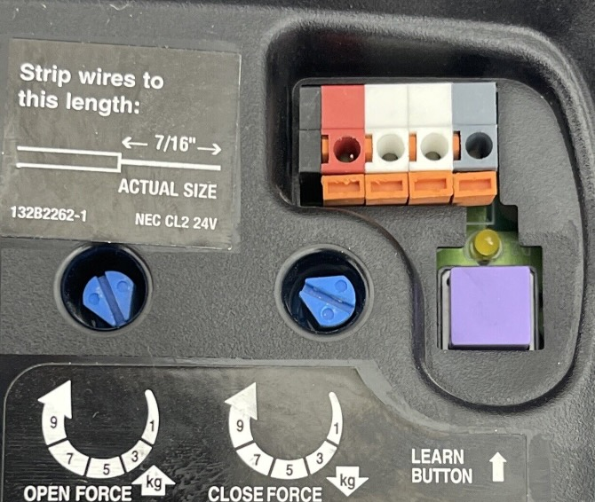

GARAGINATOR is compatible with most openers except for some newer models. Use
this page to figure out if yours will work.

## LiftMaster/Chamberlain

Units made after 2011 by LiftMaster/Chamberlain with a YELLOW learn button
AND/OR that are marked with "Security + 2.0" are **NOT** compatible. These units
use a proprietary/encrypted signal to communicate with the openers.

If you have a yellow button and would still like to use GARAGINATOR you can buy
a "Security+ 2.0 Wired Dry Contact Adapter" (Google it) from places like eBay.

If your unit has a **red, blue, purple, green, orange, black or gray** learn
button it should work perfectly with GARAGINATOR.

## Overhead Door

According to some internet research, all models will work with GARAGINATOR unless:

* It is an Odyssey 1000 / Destiny 1200
* AND the serial starts with 10 or higher

## Ryobi

Ryobi openers are their own thing, with their own app, and will not work with
GARAGINATOR (without some soldering).

## Other Brands

There are hundred(s?) of brands of garage door opener, and GARAGINATOR should
work with the vast majority. This is obviously untested, so you will need
to do some research of your own to determine compatibility. If you do, please
[let me know](/about) so we can add it to this page!

GARAGINATOR works by shorting the red/white wires together from the opener, so
you can check compatibility by very briefly touching those wires
together to see if the door operates. I wouldn't recommend this unless you are
fairly certain it will work after reading your unit's manual.
