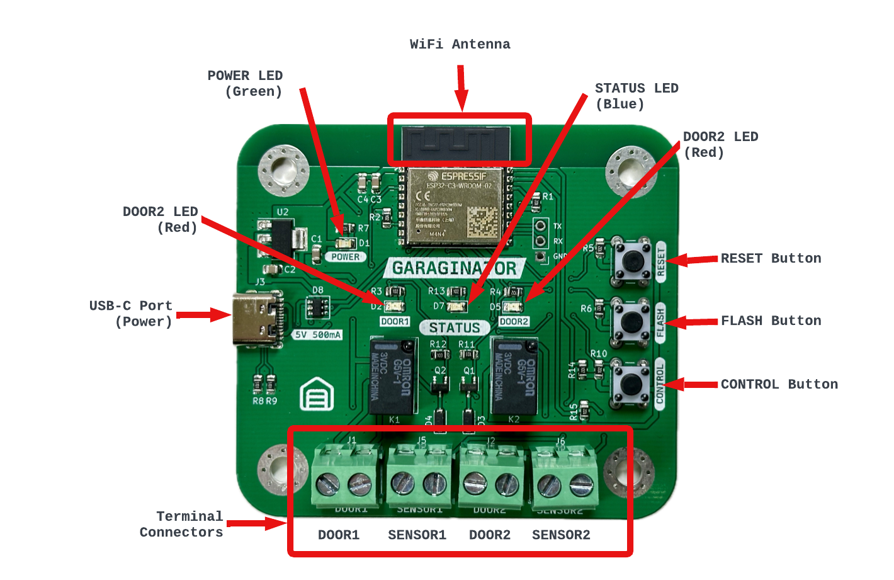
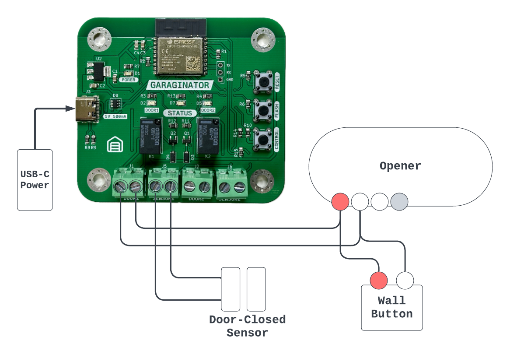

This page covers more in-depth details about GARAGINATOR and can be used as a
reference.

## 👁️ Overview

GARAGINATOR is comprised of a WiFi module, relays, and various power and control
circuitry. It also has multiple LEDs which act as indicators for various things.

**Terminal Connectors**

The terminal connectors are where GARAGINATOR interfaces with your garage door
opener and whatever sensors are in use. Use a small flat-head screwdriver to
loosen/tighten.

**CONTROL Button**

This button can be used for changing the wifi credentials, changing the
door/sensor configuration, unpairing from Home and factory resetting. To read
more check out the section about [Config Mode](#config-mode).

**RESET Button**

Pressing this will reboot GARAGINATOR. The device won't start back up again
until the button is released.

**FLASH Button**

Only used for reprogramming or upgrading. Keep held down while pressing and
releasing RESET to boot GARAGINATOR into programming mode.

**USB-C Port**

Connect a standard USB-C cable to power GARAGINATOR

**POWER LED**

Lights up when power is connected, and the onboard regulator is operating
correctly.

**DOOR1/DOOR2 LEDs**

These LEDs light up red when the garage door is being operated. When the LED
turns on, the associated relay should also "click".

**STATUS LED**

This LED does many different things depending on the context, see the [dedicated
section about this LED](#status-led).

## 🛜 WiFi {#wifi}

GARAGINATOR can connect to almost any 2.4GHz 802.11b/g/n WiFi network using
WPA/WPA2/WPA3 auth modes.

If your SSID is hidden, you can use manual SSID entry when setting up
GARAGINATOR.

GARAGINATOR does not require access to the internet, so it can be restricted if
desired.

## ⚡️ Wiring {#wiring}

⚡️⚡️⚡️**WARNING**⚡️⚡️⚡️: before doing any wiring, you should disconnect your opener from
power, or turn off power at the breaker

GARAGINATOR should work with almost any Chamberlain/LiftMaster units, unless it
has a yellow LEARN button and was made after 2011. If your opener uses 
Security + 2.0 it will not work.

Brands other than LiftMaster/Chamberlain have not yet been tested with
GARAGINATOR, however if your opener can be operated by forming a dead short
across a pair of it's terminals (usually Red and White) then it should work.
Consult your opener's manual to get a better understanding of how it operates.


Always consult your opener's manual before doing any wiring to ensure you wire GARAGINATOR correctly. Check into sections that refer to wiring wall buttons or doorbell-style wall controls.


### 🔌 Wiring Steps {#wiring-steps}

1. **Disconnect your opener from power**
1. Connect wires from the Red/White terminals on your opener to your chosen DOOR terminal on GARAGINATOR
   1. Note: It doesn't matter which way round you connect the wires to GARAGINATOR
1. If desired, wire your existing wall button in parallel with GARAGINATOR's DOOR terminal
   1. Note: It usually DOES matter which way round the wires are connected to the wall button, so be sure to keep it the same way around
1. Connect your sensor wires to the SENSOR terminal on GARAGINATOR (again, doesn't matter which way round)

If your opener doesn't have Red/White terminals or wires, you can trace which terminals your 
wall control is attached to, and piggyback off those. Consult your opener's manual
to understand better which terminals are for commanding the door.

Check the [compatibility page](/garaginator/compatibility) for more info.

### 🔥 Electrical Characteristics

GARAGINATOR is designed to momentarily short 24V contacts. It is **not designed**
to switch AC loads such as lights or fans etc. The parts used are theoretically
capable, but shouldn't be used for anything other than commanding garage door
openers.

GARAGINATOR uses Omron `G5V-1-DC3` relays. The maximum switching voltage is
60VDC, however GARAGINATOR has only been tested with 24VDC.

**DO NOT** connect AC power to any of GARAGINATOR's terminals.

## ⚙️ Config Mode {#config-mode}

Config mode is a rudimentary "menu" system and is indicated by the STATUS LED.
Config mode is used if you want to:

* Erase wifi credentials without unpairing
* Unpair GARAGINATOR
* Change Door/Sensor configuration

### ➡️ Entering Config Mode

1. Hold the CONTROL button until STATUS begins blinking **very** rapidly
1. Immediately **let go** when the rapid blinking starts (holding for longer than 10 seconds will cause a [Factory Reset](#factory-reset)!)
1. You are now in the config mode "menu"
1. The number of times STATUS blinks indicates which "menu" option is selected.
1. Navigate the menu by pressing CONTROL. Once you reach option 5, the menu will restart from option 1
1. To choose/activate the selected option, hold CONTROL again until STATUS rapidly blinks, then release. Your chosen option should be carried out.

| Blinks | Description |
|---|---|
| 1 | Exit Config Mode |
| 2 | Reboot GARAGINATOR |
| 3 | Launch GARAGINATOR's private wifi network to reconfigure wifi, or change Door/Sensor settings |
| 4 | Unpair GARAGINATOR from Home. You shouldn't ever need this, since removing GARAGINATOR from Home will cause it to unpair, but in case GARAGINATOR is gone from Home, but STATUS still incicates that it is paired (solid on) then you can use this option to clear pairing data. |
| 5 | Erase wifi credentials, but keep pairing information. |


**Note:** These patterns are different if you are NOT in Config Mode. See
[STATUS LED](#status-led) for detailed information.


You can exit Config Mode by either selecting option 1, or just pressing the
RESET button on GARAGINATOR.

## 💡 STATUS LED {#status-led}

This table explains what the STATUS LED is trying to communicate during normal operation.

| Pattern | Description |
|---|---|
| Solid on | Everything is OK! GARAGINATOR is connected to wifi and successfully paired |
| 2 quick blinks | Connected to wifi but not paired (ready to pair) |
| 1 blink | Not connected to wifi, join the `GARAGINATOR-Setup` wifi to configure |
| Rapidly blinking many times per second | About to enter [Config Mode](#config-mode) or about to [Factory Reset](#factory-reset). You are probably holding the CONTROL button |


**Note:** The patterns are different if you are actively in [Config Mode](#config-mode).


## 🔄 Factory Reset {#factory-reset}

Factory resetting GARAGINATOR will:

- Remove all pairing information
- Remove all wifi information
- Remove all door/sensor configuration

To factory reset GARAGINATOR, press and hold the CONTROL button until the STATUS LED
begins blinking very rapidly (many times per second). Keep the button held until
the STATUS LED turns completely off (which takes about 10 seconds).

GARAGINATOR is now ready to setup again as if it were brand new. You can follow
the [Getting Started](/garaginator/start) guide to get going.


**Note**: if you didn't un-pair GARAGINATOR before factory resetting, your
Home app may still show GARAGINATOR as Unavailable or non responsive. You will
need to manually remove it before re-pairing.


## Disclaimer

Use of GARAGINATOR is at your own risk. Remote garage door openers should only
be used while in direct view of the door itself. The [owner/operator](/about) of
this website cannot be held responsible for any loss or damages that may result
from the use of GARAGINATOR.
