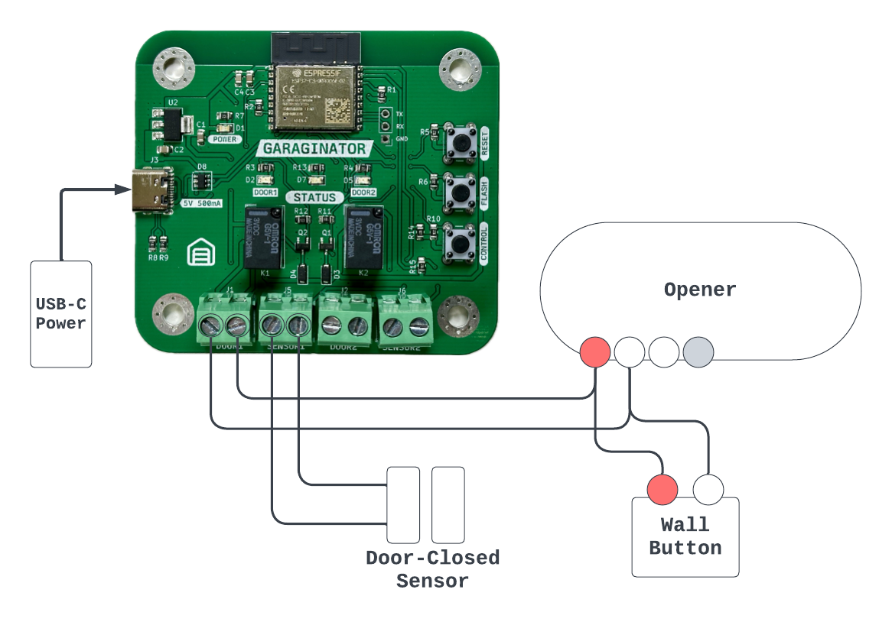

This page has all the information needed to set up and use **GARAGINATOR v1.2**.


This page is for getting started, but for more detailed documentation, check out the full [GARAGINATOR User Guide](/garaginator/guide).


## ✅ Prerequisites {#prerequisites}

Before starting, you will need a few things:

1. Read the [disclaimer](#disclaimer)
1. Your WiFi network name and password
1. A mobile device or computer
1. Decide if you will use [sensors](#sensors) to detect if the doors are open or not
1. Decide where you will mount the device

## ⏩ Quickstart {#quickstart}

If you want to speedrun the setup:

1. Plug GARAGINATOR in via its USB-C port
1. Join its [captive WiFi](#setup-wifi) network (GARAGINATOR-Setup)
   1. Configure your WiFi network
   2. Choose your door/sensor configuration
1. [Pair](#pairing) GARAGINATOR with your Home app
1. Connect [wires](#wiring) from the DOOR1 and/or DOOR2 terminals of GARAGINATOR to your opener's red/white terminals
   1. Connect in parallel with your existing door button if desired
1. Connect your door-closed [sensors](#sensors) to the SENSOR1/SENSOR2 terminals
1. Enjoy!


Longer and more detailed instructions can be found below 👇


----

# Setup

Before mounting GARAGINATOR or wiring it to your garage door opener, it needs to be set up and configured.


**Note:** these steps are easier to accomplish _prior_ to mounting GARAGINATOR in a hard-to-reach place.


## 🛜 Setup WiFi {#setup-wifi}

1. Power on GARAGINATOR by plugging in a [USB-C plug](#power). Almost any wall adapter can be used, as long as it can produce 5V and 500mA
1. If WiFi is not configured yet, GARAGINATOR will automatically start up its own mini WiFi network called `GARAGINATOR-Setup`. Connect to `GARAGINATOR-Setup` with your phone, tablet, or computer
1. GARAGINATOR's initial configuration screen should **automatically** pop up on your device
   1. If nothing pops up, open a browser and navigate to `http://192.168.1.1`
1. Select your WiFi network name from the dropdown, enter the password, and click `Connect`
1. If the connection was successful, you will be presented with the door configuration screen.

## 🚪 Setup Doors/Sensors {#setup-doorssensors}

GARAGINATOR supports up to 2 openers either with or without door-closed sensors.

## 🤝 Pairing {#pairing}

GARAGINATOR has only been tested to work with Apple Home, although it should be
possible to pair it with any system that supports the HomeKit protocol such as
Home Assistant. YMMV.

### 📡 Pairing steps {#pairing-steps}

GARAGINATOR indicates that it is ready for pairing by flashing the `STATUS` LED
twice rapidly with 2 seconds between bursts. Ensure you are seeing this pattern
before attempting to pair. More info about the `STATUS` LED can be found in the
[GARAGINATOR User Guide](/garaginator/guide#status).

1. Open the Home app
1. Click the plus button and Add New Accessory
1. Either scan the included QR code, or click More Options and choose GARAGINATOR from the next page
1. Enter the included pairing code
1. GARAGINATOR should be added to your Home

After pairing, verify that GARAGINATOR is responding to commands correctly by toggling
the doors open and closed a few times. You should see a red LED light up, and 
hear an audible "click" from the relay.

If everything is working as expected, you should move on to [wiring](#wiring)!

## ⚡️ Wiring {#wiring}

⚡️⚡️⚡️**WARNING**⚡️⚡️⚡️: before doing any wiring, you should disconnect your opener from
power, or turn off power at the breaker

GARAGINATOR should work with almost any Chamberlain/LiftMaster units, unless it
has a yellow LEARN button and was made after 2011. If your opener uses 
Security + 2.0 it will not work.

Brands other than LiftMaster/Chamberlain have not yet been tested with
GARAGINATOR, however if your opener can be operated by forming a dead short
across a pair of it's terminals (usually Red and White) then it should work.
Consult your opener's manual to get a better understanding of how it operates.


Always consult your opener's manual before doing any wiring to ensure you wire GARAGINATOR correctly. Check into sections that refer to wiring wall buttons or doorbell-style wall controls.


### 🔌 Wiring Steps {#wiring-steps}

1. **Disconnect your opener from power**
1. Connect wires from the Red/White terminals on your opener to your chosen DOOR terminal on GARAGINATOR
   1. Note: It doesn't matter which way round you connect the wires to GARAGINATOR
1. If desired, wire your existing wall button in parallel with GARAGINATOR's DOOR terminal
   1. Note: It usually DOES matter which way round the wires are connected to the wall button, so be sure to keep it the same way around
1. Connect your sensor wires to the SENSOR terminal on GARAGINATOR (again, doesn't matter which way round)

If your opener doesn't have Red/White terminals or wires, you can trace which terminals your 
wall control is attached to, and piggyback off those. Consult your opener's manual
to understand better which terminals are for commanding the door.

## 🪄 Sensors {#sensors}

GARAGINATOR considers a door "closed" if the attached sensor forms a closed circuit.

The recommended way to add sensors to your door is with a magnetic reed switch
such as [these you can buy on Amazon](https://a.co/d/eEVxfVv) (just make sure they are Normally Open (NO)) but you could also use another type such as tilt switches.

### 😢 Using without sensors

Using GARAGINATOR with sensors is recommended and leads to a better experience, however you can
choose not to use sensors during initial setup.

In no-sensor mode, when you tell GARAGINATOR to open or close the door, it will simply wait 5
seconds, and then report the state that you asked for.

What this means is that the state reported via Home could be out of sync with the
real state of the door if you operate the door without using GARAGINATOR.

If you are using no-sensor mode, you can still do all the normal things like open-late 
notifications, however it is up to you to ensure that the door state doesn't get
out of sync with GARAGINATOR's reported state.

## Finishing Up

Once GARAGINATOR is powered up, connected to wifi, paired to your Home, and wired
to your opener you should consider mounting it near the opener (for shorter wire runs).

An STL file for a mountable enclosure will be made available soon for
those folks with 3D printers. Otherwise you can simply mount garaginator directly
using its mounting holes.

Happy GARAGINATING!

## Disclaimer {#disclaimer}

Use of GARAGINATOR is at your own risk. Remote garage door openers should only
be used while in direct view of the door itself. The [owner/operator](/about) of
this website cannot be held responsible for any loss or damages that may result
from the use of GARAGINATOR.
