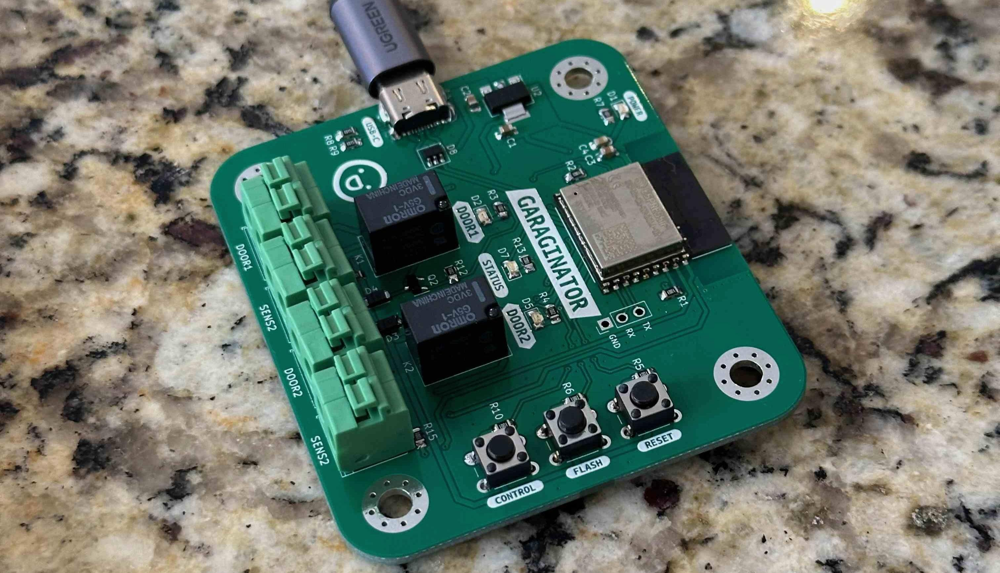
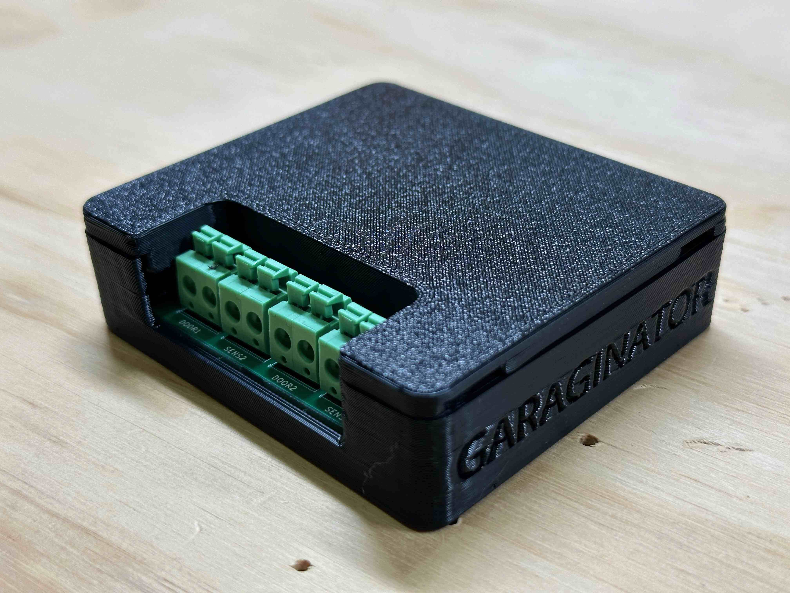
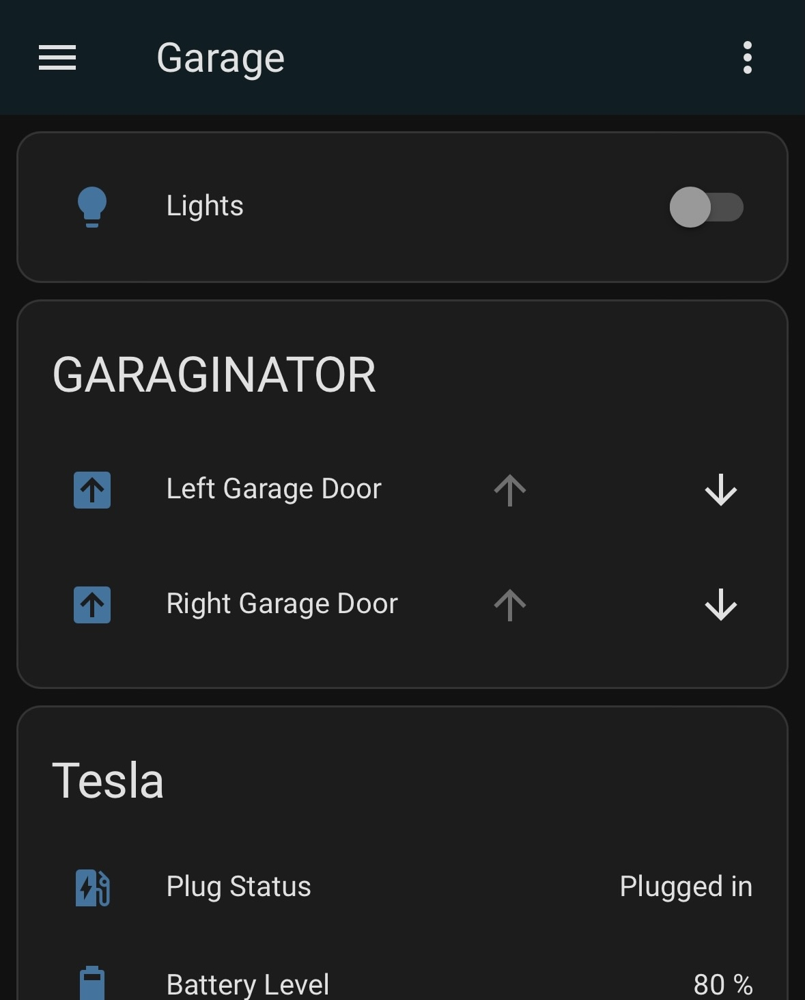

## Updated Dec 8, 2023 ✨

If you are interested in buying a GARAGINATOR you can now join the waitlist!

[CLICK HERE TO JOIN THE WAITLIST](https://garaginator.square.site)

---

## What is this?

This device connects directly to many popular garage door openers as a virtual
"button" to signal to the opener that it should open (or close).

It pairs with your smart home via Apple HomeKit (or you can use Home Assistant
via the [HomeKit Device integration](https://www.home-assistant.io/integrations/homekit_controller/) - no Apple hardware required!).

Best of all, there is no internet dependency. All network traffic is
_local only_.

GARAGINATOR is powered by a standard USB-C plug and will work with pretty much 
any regular phone charger or similar charging plug.

## Why did I create this?

The company MyQ recently decided to shutter access to its API from its
customers. I owned a MyQ smart garage door opener for many years and integrated
it into my home automation setup, only to have it stop working due to this API
change.

Since I had the skills and the determination to make it happen, I decided to 
make my own, but with some improvements such as local-only operation, and native
HomeKit support.

## How does it work?

GARAGINATOR supports 2 separately controlled doors. Each door requires a pair of
wires connected from the device to your actual opener (the motorized unit on
the ceiling of the garage).

Additionally (optional but highly recommended) you can connect a sensor (e.g. a
magnetic reed switch) to GARAGINATOR to tell it the state of the door (if it's
open or not). This status is also shown via HomeKit in realtime.

## FAQ

### Will it work with my garage door opener?

This will work with any non "Security + 2.0" Chamberlain/LiftMaster openers.
If your opener has a simple wall button which is connected via 2 wires (e.g. a
dry contact) then it should work. GARAGINATOR operates by acting as a momentary
switch via an onboard relay. If you're unsure, [contact me](/about)!

### What if I don't want to use HomeKit?

There's no reason at all why you couldn't reflash this with ESPHome. In fact
I plan on open sourcing an example ESPHome config for this device (stay tuned).

### Is it secure?

All messages between GARAGINATOR and the HomeKit controller (either Home
Assistant or your Apple Home hub (TV, HomePod, iPad etc)) are fully encrypted
in-flight as-per the HomeKit spec.

Wifi credentials and the HomeKit pairing code are set by you during setup!

### Is this the same thing as ratgdo?

GARAGINATOR achieves pretty much the exact same end result as
[ratgdo](https://paulwieland.github.io/ratgdo/), yes! GARAGINATOR strives to be
super simple to set up, even for non-technies while ratgdo is a lot
more mature and supports a wider range of openers.

### How can I get one?

- All the design files will be open sourced on Github (soon!) so you can make
  your own!
- If you are interested in buying a GARAGINATOR please join the waitlist here: <https://garaginator.square.site>

