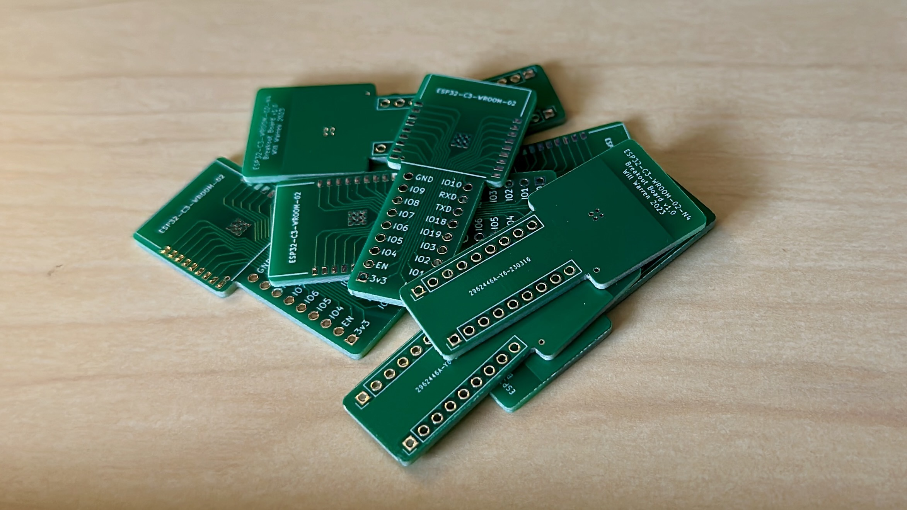
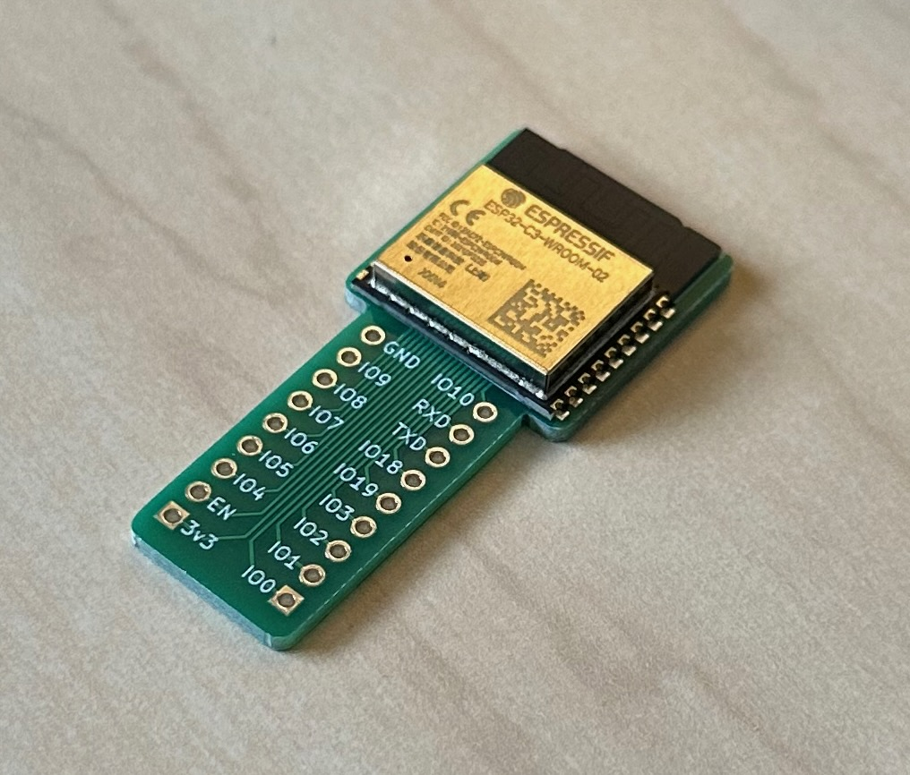
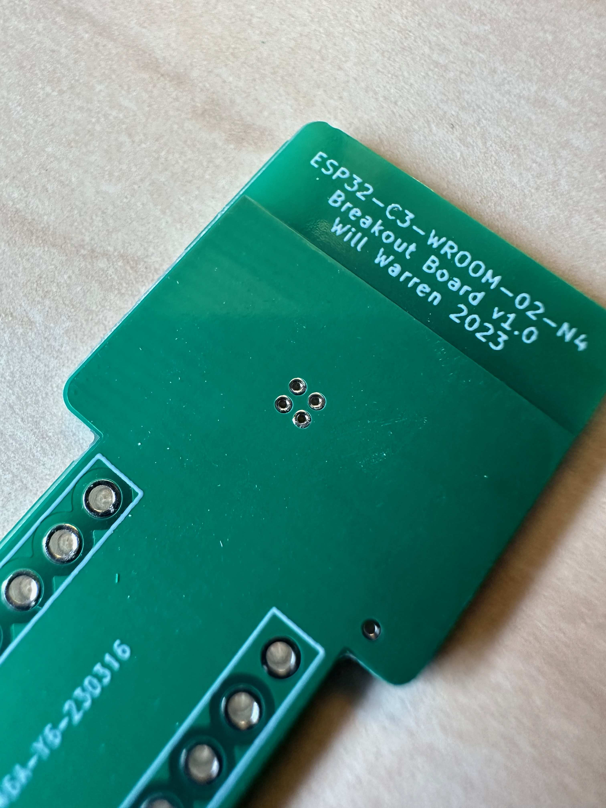
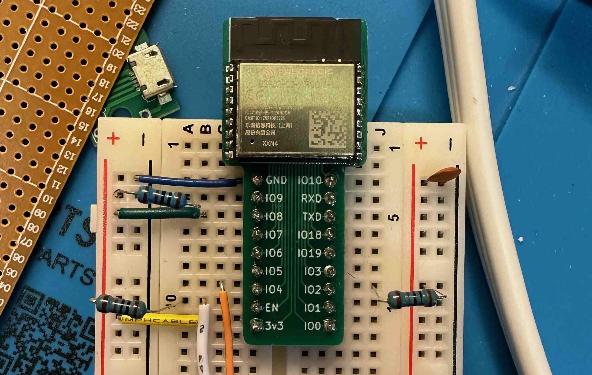
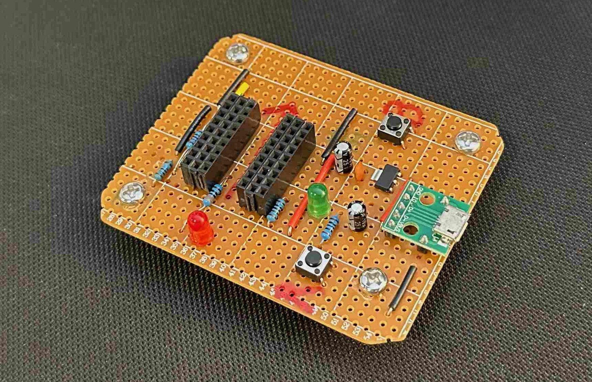

🥳 **Update:** You can now buy the boards premade from my Tindie store:
<https://www.tindie.com/products/33043/>.

---

Similarly to my previous project for the ESP-12E/F modules, I wanted to be able
to experiment with the `ESP32-C3-WROOM-02-N4` module. The pitch of the
castellated pins on the module makes breadboarding difficult, so I created a
very simple breakout board in KiCAD.

Note: throughout this post I talk about the `02` version of this module, but
this breakout board would work totally fine with the `02U` variant (without the
PCB antenna).

After designing the PCBs in KiCAD I sent them away to JLCPCB to fabricate.

One specific option I chose when ordering the PCBs was untented vias. This
allowed me to solder the EPAD under the module more easily (from the bottom).
Still, I wouldn't recommend this, and would suggest using a hotplate or reflow
oven instead.

After assembly the boards work great!

## Get the board!

🥳 You can now buy the boards premade from my Tindie store:
<https://www.tindie.com/products/33043/>.

Alternatively, you can have your own boards fabricated from your preferred PCB
fab manufacturer using the KiCAD files from Github! The files can be found here:
<https://github.com/phybros/esp32-c3-wroom-02-n4-breakout>.

Hopefully this can be helpful to fellow tinkerers!

---

## Bonus Janky Dev Board

I made this "dev board" very quickly with parts I had laying around. Features:
- All the required strapping pins
- Micro USB connection for power AND programming
- 3.3V regulator (legs shoved violently into the perfboard in defiance of nature)
- LED on GPIO4
- Power LED
- "Breadboarding area" made of pin sockets

I just slotted one of the breakout boards into the middle "socket" and away I
went! I recently used this exact board to prototype a new smart Garage Door
opener! More on that in a later post 😉.

