
Hello! This is the third part of the series about [WCPU-1](https://willwarren.com/tags/wcpu-1/), my homebrew 8-bit computer.

Check out [Part 1](/2025/04/29/building-my-own-cpu-wcpu-part-1) and [Part 2](/2025/08/14/building-my-own-cpu-wcpu-part-2-simulation)!


## Recap/Intro

Let's just get this over with:

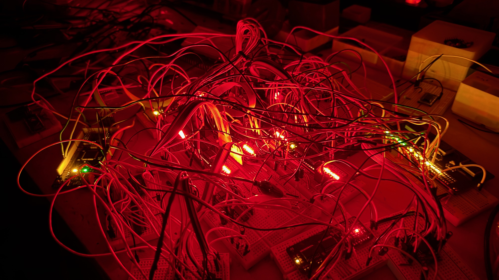

So in [Part 2](/2025/08/14/building-my-own-cpu-wcpu-part-2-simulation) I simulated the whole design in Logisim-Evolution and tweaked it until I was happy. I was emboldened, and felt pretty confident that I wasn't going to make any **Big Mistakes** with the real hardware...


This post covers what actually happened when I started building the physical thing. Spoiler: it was humbling. There are backwards LEDs, floating address lines, cursed EEPROMs, and at one point I just learned to read binary by staring at some blinking lights because I've been too lazy or distracted to build an output register yet.

This build of WCPU-1 should be seen as a *prototype* to validate the design and wiring before moving to the "real" PCB design.

I've written this in a sort of "don't make my mistakes, kid" war-story style, so it's a little crazed at times and probably a little embarrassing, but here we are.

Also it's very, very long. Sorry.

You already saw the "hero shot" of the build with all the red lights looking like something out of the Upside-Down, but here's another shot in the light of day:

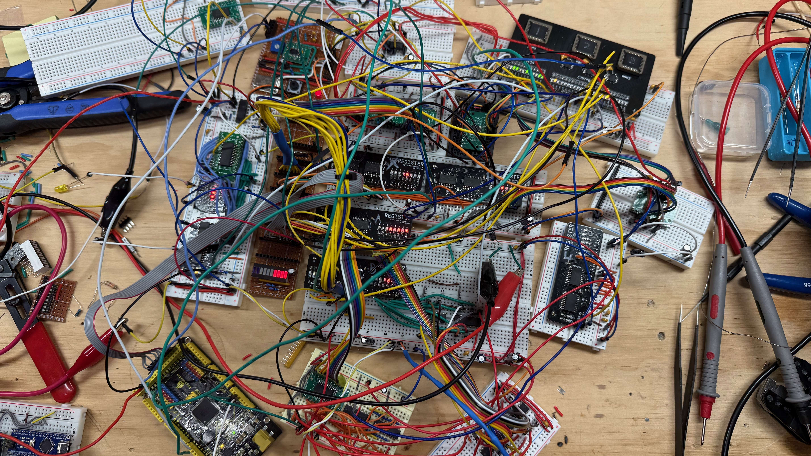

## So Much for "No Breadboards"

Of course, right out the gate I made some decisions which eventually felt like mistakes.

With the schematics roughed out in KiCAD (mostly traced from my Logisim design, which worked shockingly well as a reference), I started ordering parts from Digikey. If you plan ahead you can hit the free shipping threshold, which I'm going to pretend was strategic and not just the result of buying way too many LEDs.

In my mind I was thinking that I want everything on the **final** build to be Surface Mount Technology (SMT) and so that's pretty much what I ordered. I was going to make a few PCBs and connect them all together (how??) to experiment/validate ideas. But in the end there was so much rearranging that I decided to only create a couple of PCBs (more on that later) and do the rest breadboard style. Only you can't put SMT chips into breadboards...

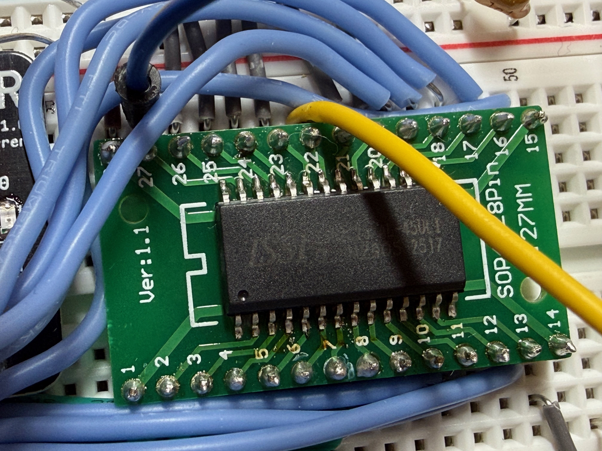

So if I had to do this again, I would always order a bunch of SMT parts, but also 2-4 of the DIP version of the same chip from the same manufacturer for testing/validation. They are almost always available. If I'm going to end up using breadboards everywhere anyway, might as well just get DIP packages for the prototype.

Adapter/breakout boards to the rescue.

## Custom PCBs from PCBWay

I ordered three custom PCBs for the first batch:

### The EEPROM Programmer Board

This was the first board I needed to have since without it I can't program the microcode ROMs and nothing else will work.

It's a standalone tool that lives outside the computer. I put the EEPROM into the socket, and connect via serial to my laptop to upload the binary files.

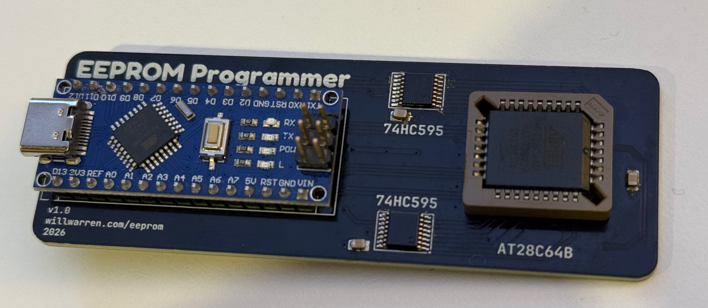

I had Claude Code help me design and implement a serial protocol for sending files over the wire and having them get written to the chip. This pairs with the microcoding system I created in python, which generates the binary files and then also connects to the serial port directly and uploads them. It's pretty neat and allowed for pretty quick iteration!

#### Mistakes

The Arduino Nano (clone) on the board is connected to all the address and data lines via 2 shift registers.

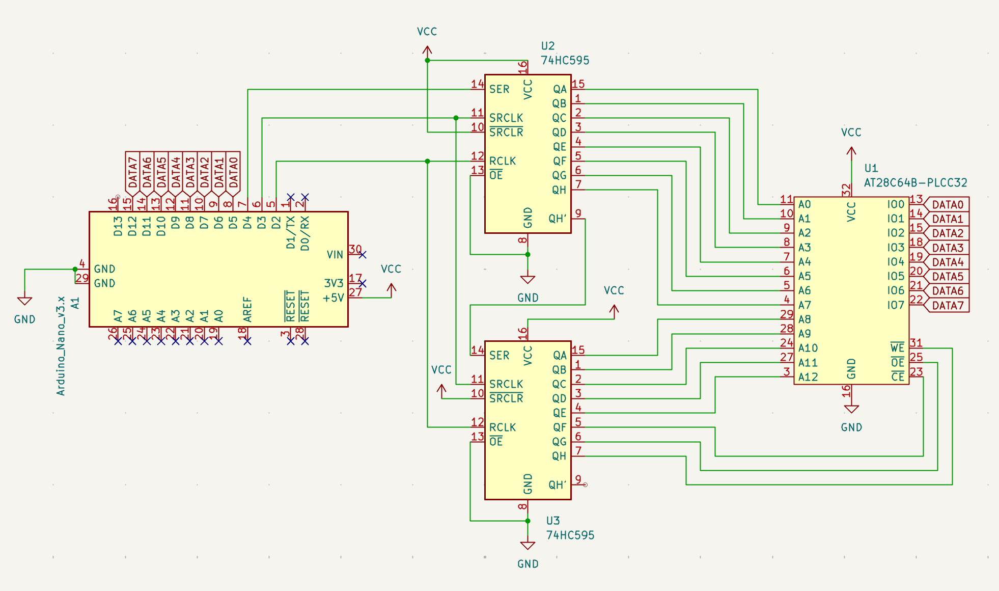

But it's also connected to the control pins (`OE`, `WE`, `CE`) via the shift registers!! That means the most significant three bits of the data being shifted out also control when and how the data is written.

This unfortunately limited the speed at which I could safely write to the EEPROMs. If I had those 3 pins just connected to free GPIOs on the Arduino, I could have used the Page Write capabilities of the chips, which allows for writes waaaay faster than one byte at a time. In my testing I could rewrite the entire 8KB EEPROM in about 80s one byte at a time, and in about 1.3s with page writes.

That said, in "slow mode" it did work on the first try, which is a win in my book.

### The Generic Register Board

This was probably my greatest success in this project so far.

I designed a generic register PCB which contained a `74HC377` octal D type flip flop (to hold the actual data) and a `74HC245` for its tristate bus connection.

This way I could just connect all the registers to the same bus, and differentiate them by which IN and OUT control lines they were connected to. Very tidy.

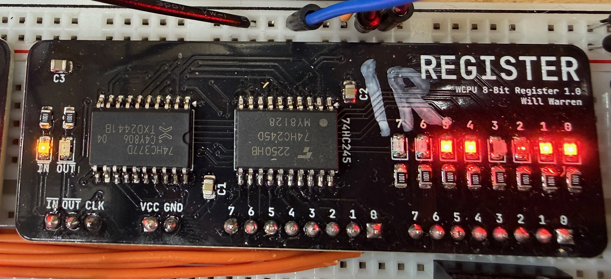

Other than IN, OUT and power pins, the left set of 8 pins is the I/O connection to the `74HC245`. The right-hand set of pins is the output pins from the `74HC377`. Of course there are also many blinkenlights showing the internal state of the register. Super handy for debugging!

#### A Note on the `74HC377`

In future builds I would probably choose to work with the `74HC574` instead. The reason being that the '377 doesn't have tristate outputs - so you require something like the '245 to connect to a shared data bus, adding 1 extra chip to your count.

The drawback of something like the '574 is that there's no way to see the internal state without outputting it somewhere (like the bus). So for debugging and demonstrator type projects, the 377 is fine because you can connect it to some LEDs as I have done, and then into a bus transceiver, but if you just use the 574 in the exact same way, you ALSO have the option to reduce your chip count since you don't need the `74HC245`. Drawback obviously being fewer blinkenlights. 

This board worked perfectly first try and has been rock solid, btw. No big deal 💅.

### The Control Module Board 😩

This board is extremely simple. It just holds the 3x `AT28C64B` EEPROMs that generate the 24-bit control word.

It takes addresses in, and poops out the microcode steps, asserting/deasserting control lines and driving the whole computer. Simple right?

I designed the schematic and the PCBs, sent them off to PCBWay and all was well!

Then a bunch of bad things happened:
- The boards were mis-shipped on the first attempt by PCBWay. I received some other random person's PCBs. Got it re-made and re-shipped, not a huge deal (more on this below)
- I inverted `CE` in the schematic which is actually active-HIGH. So in the microcode ROM I have to invert it, again
- Oh, and whoops, no decoupling capacitors anywhere. I bodged some in afterwards.
- There was another massive design flaw: the Output Enable and Write Enable pins weren't connected to anything at all! They were just floating and doing whatever they wanted, meaning that they were corrupting themselves continuously. I performed the world's smallest bodge 6 times, and that issue was resolved
- I INSTALLED ALL 36 LEDs BACKWARDS. Every single one. I had to rotate them individually with my hot air station and tweezers. Very zen, but very, VERY tedious

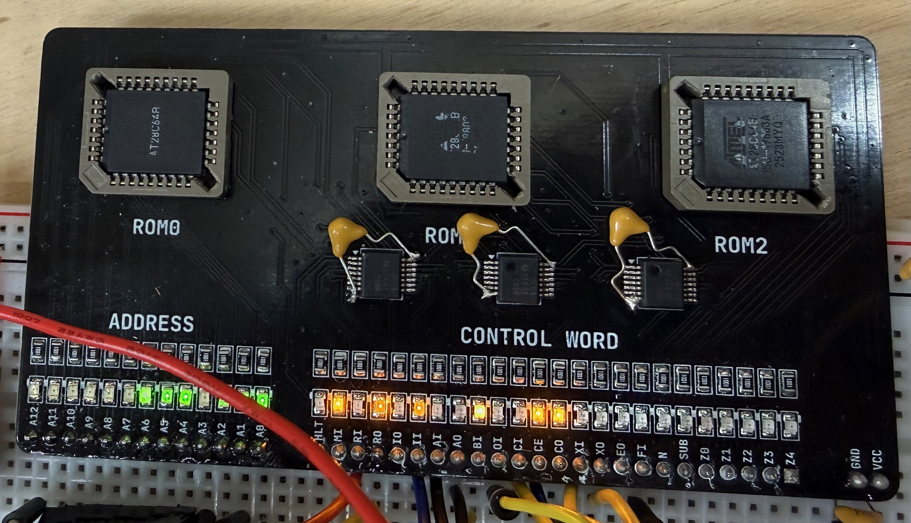

After all that, to my surprise, it worked perfectly. Or so I thought... (foreshadowing again!!!).

To see my review of PCBWay's services, scroll almost all the way to the bottom.

## Real-World Demons (a.k.a. stuff Logisim didn't warn me about)


**Spoiler**: It was ***NOT*** just like the simulations.

### 1. The Clock

I built my clock on some perfboard, with some little switches to choose between single step, adjustable 555, and a 1MHz crystal oscillator.

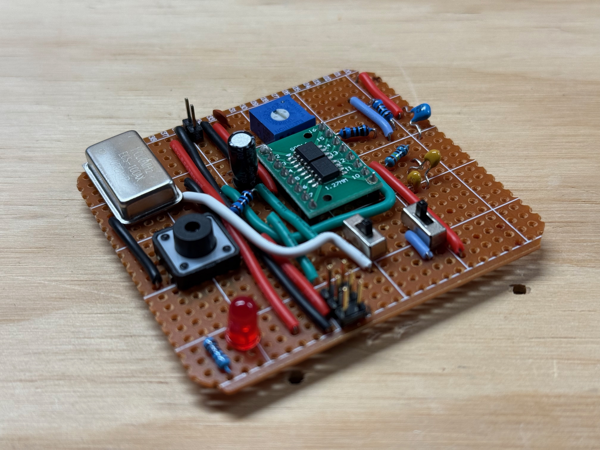

This surprisingly actually works OK! I can basically go from ~0.5Hz to about 450Hz with the 555, and the single step button is nicely debounced with another 555 timer.

One minor issue is that the switches to change between modes are not properly debounced and can cause the occasional glitch. A workaround is to just hold the computer in reset, choose the mode, and then take it out of reset. It's only really an issue going to/from 1MHz mode. I'll fix it in the real deal.

#### Gross Edges

The clock module does not produce very nice edges. I eventually fixed this by routing the output into a Schmitt Inverter which has some built-in hysteresis and cleaned those edges right up.

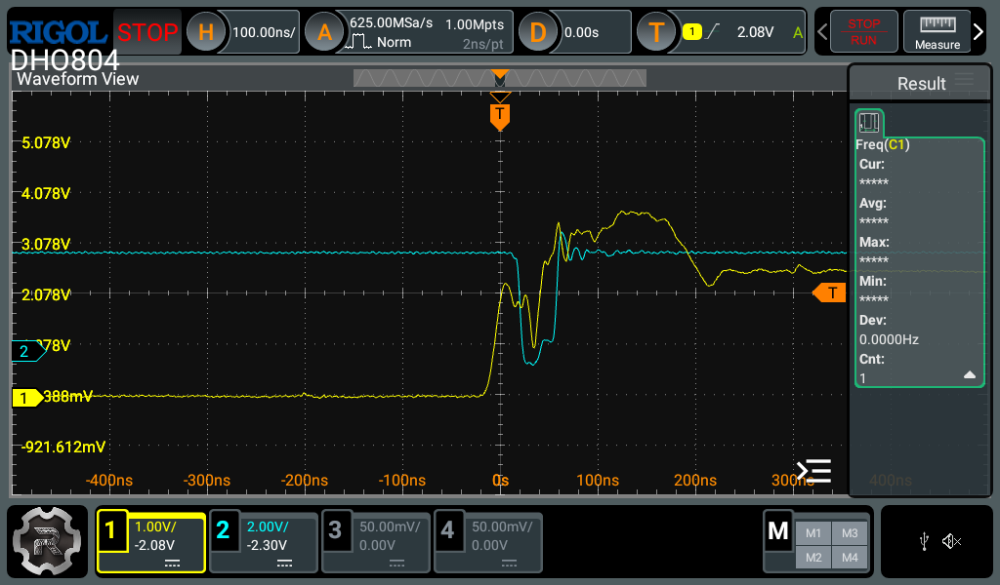

The yellow line here is the drooopy clock signal. This is a combination of poor power distribution and bad wiring. The blue line is an example of a downstream device spuriously going low at the wrong time because of the "falling edge" in the middle of the clock pulse.

So now the flow is from the clock module -> schmitt inverter (produces my `~CLK` signal) -> into another Schmitt inverter (produces my `CLK` signal). In later/better versions I will probably still use the Schmitt inverters because they sort of guarantee a level of edge quality that we want.

### 2. Instruction Register, Flags and T-State Timing

The Instruction Register, the Flags Register and the T-State counter all feed directly into the EEPROMs, and thus cause the control lines to change. If we are latching all registers on the rising edge of the `CLK` signal, that causes a problem.


In this amazing diagram `T` is the t-state counter and `F` is the flags register, for example.

We want `T` AND `F` to change at the green line (or the blue line) NOT in the middle of an instruction happening. They need to change **together**.

If we could move `F` back, then that means the falling edge of `CLK` is where we do all the setup. `CLK` goes low. Chaos ensues. Control lines are asserted and deasserted. Data goes on the bus, sometimes from more than one place. In the distance, sirens.

It should also be noted that the Instruction Register has the same issue! And we can't just clock these registers with the `~CLK` signal since then they would be a whole cycle too late.

#### The Solution

To solve this, I tied the outputs of the Flags Register and Instruction Register into another `74HC377`, which was clocked with the rising edge of the `~CLK` signal (which is also the falling edge of the `CLK` signal). With the Output Enable pin tied low, the clock pin has all the control over when that value will emerge, and start controlling the EEPROMs.

Now, all the craziness of the setup time happens at once, and we don't need to worry about control lines going nuts in the middle of an instruction.

### 3. EEPROM Glitches

The EEPROMs I'm using for the control module glitch a lot when the input address changes. Here's a nice example - the yellow line is an address pin changing, and the blue line is the EEPROM glitching temporarily low for about 25ns.

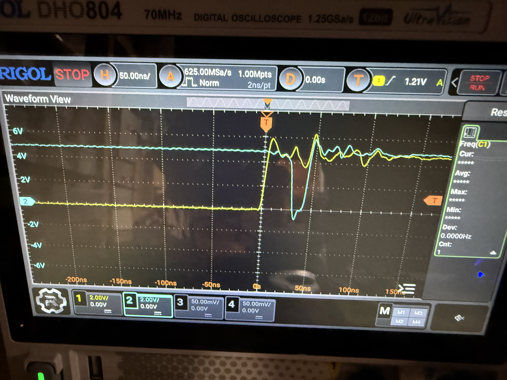

The datasheet for the AT28C64B actually covers this topic pretty well. Basically once the address pins change, for the next up-to-150ns, ANYTHING CAN HAPPEN. An output pin that was low can flicker high and then back low. High pins can do the opposite (like in my photo). It can start raining upwards, and hamburgers will eat people. Once the 150ns is over, everything is rock solid and stable.

Generally this is not a MASSIVE issue as long as your entire build is synchronous and you have separate phases for setup and latching, as I have explained above. Essentially, nothing is latching anything during this glitchy time anyway so it's fine. Values on the bus are ignored. All is well...

#### Even Worse Glitches?

Now, given that I just said that glitches at address changes are a known and normal thing, why would THIS be happening? 🤔

The blue line is one of the control lines coming out of the EEPROM. The yellow line is CLK.

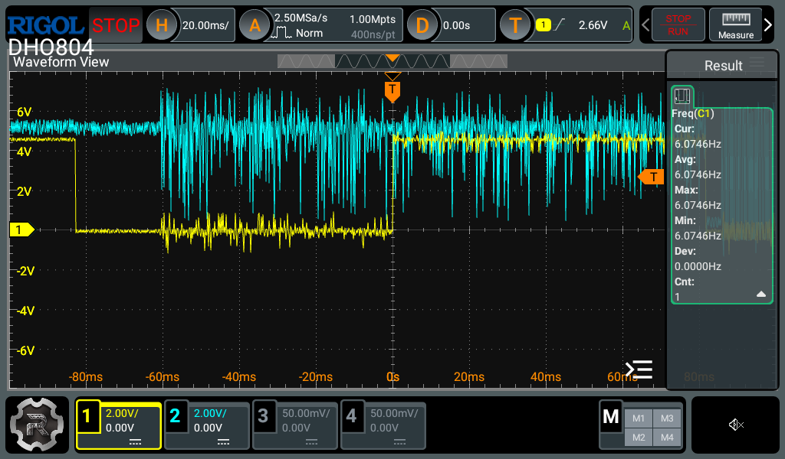

And here again, you can see the `CLK` goes low, and the EEPROM just goes crazy, and not just for 150ns! It just keeps glitching for the whole low cycle, and then also at some random times.

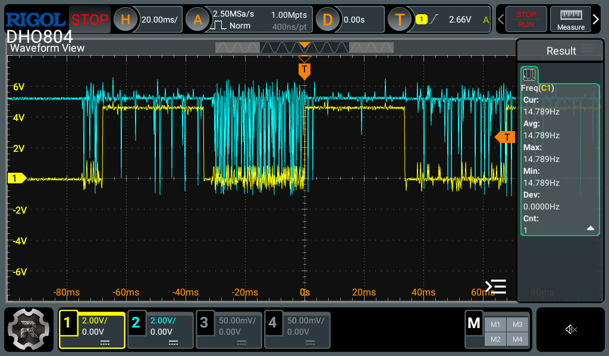

Here's the weirdest example I was able to capture where one of the control lines was just oscillating forever. This was true even with the `CLK` halted etc. crazy stuff.

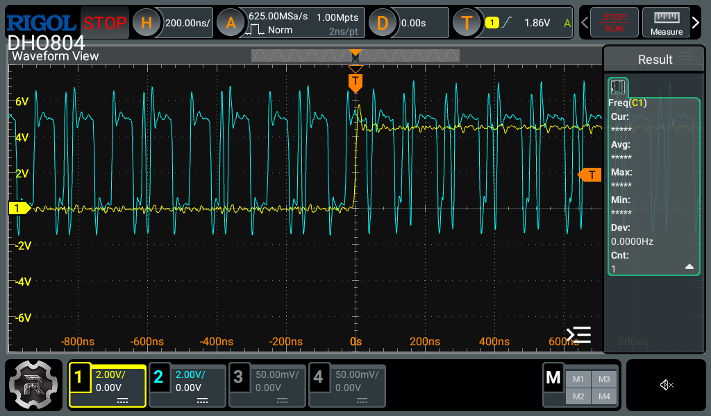

**So what is to blame?** A bad solder connection 🤦🤦🤦

Yes. Not one, but TWO of the address lines had no continuity to not one, but two of the EEPROMs 🤦🤦🤦🤦🤦🤦🤦🤦

So those address lines were essentially floating, meaning that they are interpreted as just...whatever...at any time they felt like it.

I resoldered those connections and it has been rock solid ever since 🙃

I always, always, always do continuity checks after assembling PCBs, but this time I was so excited to get going that I didn't do it, and it cost me probably multiple tens of hours debugging strange behaviour. Don't be like me.

Anyway...

### 4. RAM Timing / Bus Contention / Asynchronous Chaos

I was going to write a really long explanation of this, but instead I think I'll just keep it short and sweet to save my sanity.

Basically anything that was writing to RAM would sometimes work and sometimes not. This is becoming a theme!

What I realized is now insanely obvious in hindsight, and I feel dumb for not realizing/solving sooner.

The RAM chip I'm using (`IS62C256AL`) is asynchronous, meaning it has no clock signal to tell it when to do things. If you want to get it to write whatever is on the bus to itself, you bring the `~WE` (write enable) pin low, then when you take it high again, the data is written. Nice.

In my design, the control signal `RI` (RAM IN) is wired directly to the `~WE` pin on the `IS62C256AL`.

Maybe you can see where this is going. The `RI` control signal is driven by our glitchy friends the EEPROMs. So naturally if `RI` glitches high-low-high or low-high-low or any other pattern, the RAM chip will store whatever is on it's I/O pins at that instant. What is on it's I/O pins at that instant is highly (astronomically) unlikely to be what you actually want at that instant.

#### Solution

The solution is to "gate" the `RI` signal with our clock signal. That is to say, that the RAM should completely ignore `RI` until a time of our choosing.

In my design's case, the time we choose is the rising edge of `CLK`. That is the time that we've chosen for all things to latch data, and RAM shouldn't be any different.

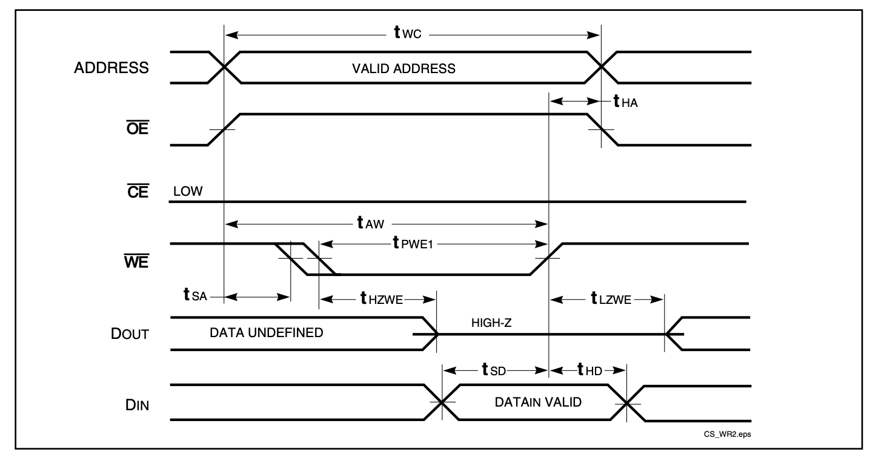

The RAM commits data on the **rising edge of the active-low `~WE` signal**. That means we need to gate `RI` with `~CLK` so the write only completes at the correct time. That will produce a LOW signal (which starts the write process) only if `RI` AND `~CLK` are both low. Then when `~CLK` changes, `WE` will go high again, committing the write at the time we wanted.

**This fix solved the last problem that was plaguing the build.**

## It Works!

After finally fixing the RAM timing issue, everything finally clicked (clocked?) into place.

The computer runs. At 1 MHz. All tested programs execute correctly. It can run fine unattended for days at a time.

23 instructions, 3 addressing modes, 256 bytes of RAM (for now). It's Turing complete.

Fibonacci, counting loops, conditional branching all working fine at full speed.

I've gotta say the feeling of seeing the whole thing working perfectly, and handling anything you can throw at it is just amazing. It's been a long road but I've learned a **LOT**.

Check out this video of the wire jungle running the Fibonacci sequence (still with the temporary Arduino-based output register):



## "Build Techniques"

After fixing the timing issues and glitches, and the computer was finally stable, we get to another topic: how this thing was actually wired together.

I put the section title in quotes basically because there were no techniques. I just used solid core wire and joined things together with whatever length would reach. I was quite afraid this would limit the speed at which I could run the computer, but really it just meant I needed really good power connections throughout the build and a LOT of bulk and bypass capacitors (I used 1uF and 100nF respectively)

There is no organization, and no structure really, except a couple of co-located things.

Here is a map of the thing, but be warned: this image may disturb you 😂

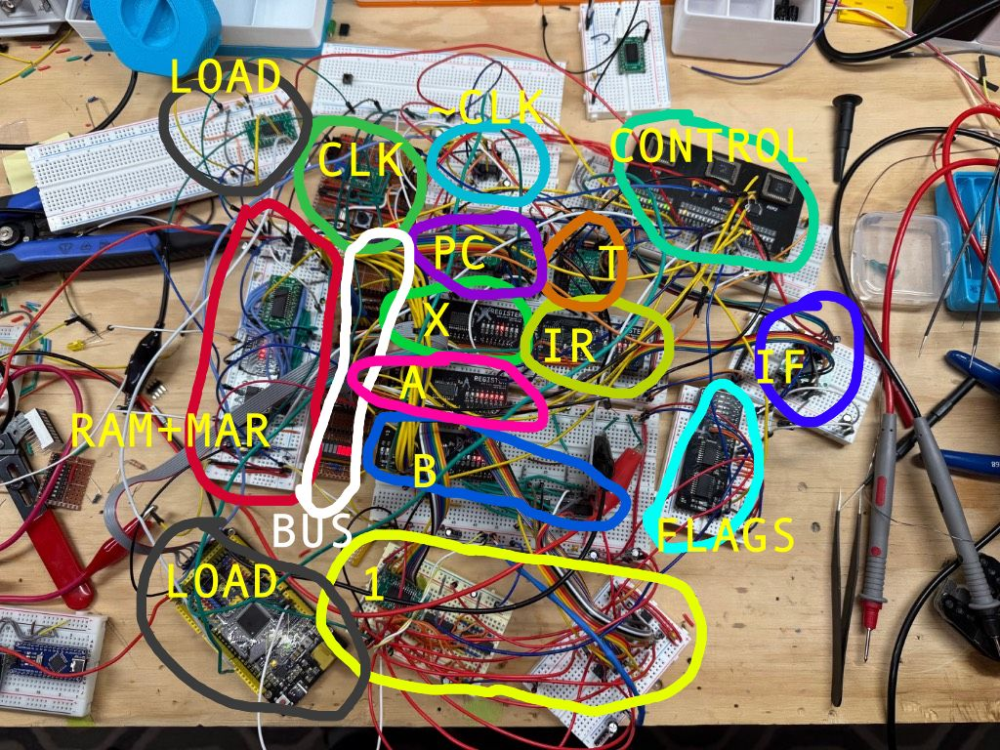

In this image you can see:
- **CLK** (the clock)
- **~CLK** (actually just the schmitt triggers for the CLK)
- **CONTROL** (EEPROM-based control logic)
- **PC** (Program counter)
- **T** (T-step counter)
- **BUS** (the bus)
- **RAM+MAR** (RAM and Memory Address Regsister)
- **1** (the ALU, not sure why I put 1. There is also the zero detect logic and its bus transceiver)
- **FLAGS** (The flags register)
- **IR**  (Instruction Register)
- **IF** (the 74HC377 that gates IR and FLAGS to the correct `~CLK` phase)
- **X**,**A** (registers)
- **B** (the B register plus all the XOR gates used for the SUB instruction)

I will say that it all came together quite quickly because I wasn't cutting, stripping, and bending a zillion little wires to the perfect length.

For me personally, I feel like I know the design inside and out, so troubleshooting is not a problem. But if you are new or learning, I would **NOT** recommend the "bundle of airwires" approach.

Each wire is also basically a capacitor, so if there is contact resistance from crappy breadboards for example, you've created a nice little RC filter which will slow down your nice sharp signal edges into loong slow curves instead. So **beware**! And scope everything with the oscilloscope if you can!

## The Arduino Mega: World's Most Overqualified ROM Loader

Using DIP switches to load a program into RAM got very old very quickly. Since this machine has 256 usable bytes of RAM, the programs can get kind of long.

Instead I sort of hacked an Arduino Mega into the middle of it.

It's directly connected to the bus and some of the control lines (`RESET`, `II`, `RI`, `MI`, `CLK`).

I also route the `CLK` line via a little SPDT switch which controls whether `CLK` comes from the actual clock, or from the Arduino.

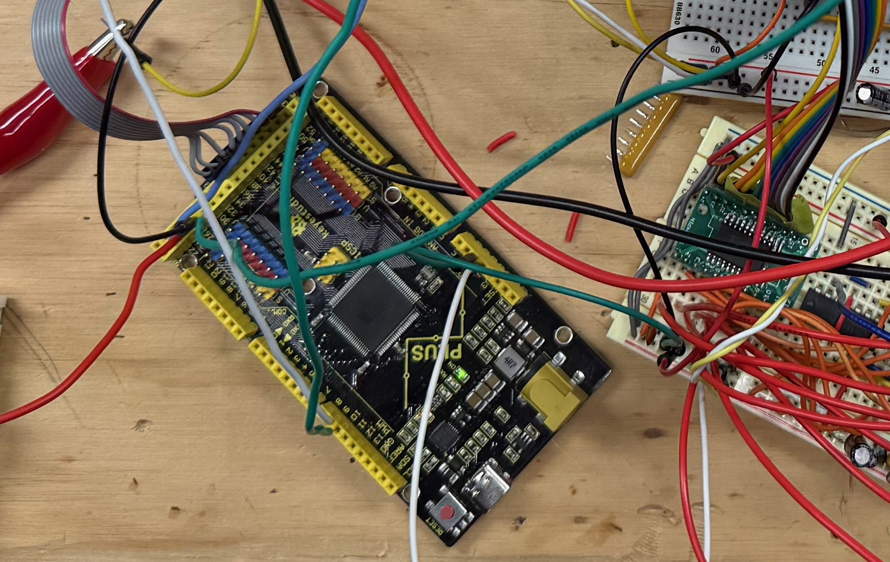

On boot, the Arduino pulls reset low, then shoves bytes into RAM one by one, pulsing `CLK` as it goes, and then releases the reset line and sets all the control line connections to "INPUT" (which makes them High-Z, effectively unplugging them from the circuit).

So the process to load the program is:

- Switch the `CLK` line to the Arduino
- Power up the WCPU-1 if it isn't yet
- Press the reset button on the Arduino
- The Arduino stuffs the program into RAM in about 10ms
- Hold down the WCPU-1 reset button
- Switch the `CLK` back to the real clock
- Let go of the reset button

This didn't always work very well, and honestly it is a **huge hack**. The logic levels on the control lines are all over the place because the EEPROMs are also trying to drive the lines.

In practice, this bus fighting originally prevented the Arduino from writing to RAM at all. So in the image above you might see a thing marked LOAD that is just a `74HC245` on its own whose Output Enable pin is controlled by the Arduino.

In this way, the Arduino can cut the EEPROM off from the `RI` line temporarily while it's working, and then it relinquishes it back again afterwards. None of the other control signals seemed to care about the Arduino, but `RI` is incredibly sensitive.

The proper way to do this would probably be to wire the `OE` pin of all the control logic EEPROMs up to the Arduino, then you could effectively "unplug" the whole module from the computer while the Arduino loader did its thing. Unfortunately for me, I didn't break out the `OE` pin on my Control Module PCB!

#### The "real" solution

My goal here is to remove the Arduino completely. I will divide the addressable RAM into 2x 128-byte blocks with the first being wired to (another) EEPROM.

Then the program can just live in the EEPROM permanently, and on boot the program will already be there.

I really want WCPU-1 to be a sort of one-board demonstrator. As such its only going to run _relatively_ basic programs so I'm OK with the loss of RAM.

---

## Rolling My Own Toolchain

OK the Arduino is putting programs into RAM for now. But what are those programs? How do they work? How am I writing the code? How do I generate the microcode images for the glitchy EEPROMs?

Well I'm glad you asked.

### The Microcode Generator

It's just a very simple Python script that builds a big array and dumps it into three binary files (`rom0.bin`, `rom1.bin`, `rom2.bin`), one for each EEPROM. Each EEPROM is responsible for 8 control signals. ROM2 has a few unused ones at the end which I could use for new functionality in future.

Each instruction is defined as a list of control signal combinations per T-step. For example NOP is just `[CO | MI, RO | II | CE, N]`. It reads a bit like pseudocode for what the hardware should do at any given time.

A tricky part is conditional instructions. I apply a mask to the Flag bits so the same opcode can have completely different microcode depending on which flags are set. JC (jump if carry) literally has two different sequences baked into the image. One of them loads the new address into the PC, and one just skips past the operand.

The EEPROMs have 13 total address lines and I laid them out like this:

```
SZC IIIIII TTTT
```

`SZC` are the **Sign**, **Zero**, and **Carry** flags. The `I`'s are the 6 bits of the current instruction, and the `T`'s are the 4 bits of t-state. So I can have 64 different instructions each with up to 16 microcode steps. Maybe overkill.

### The Instruction Set

I decided to keep it simple, since I'm not planning on adding a crazy amount of capabilities and I expect the programs in WCPU to be relatively simple. I have space for 64 different opcodes and at the moment I have 23.

Despite the simplicity you can find some pretty creative ways to use these instructions to make cool programs. There is also immediate and absolute addressing modes for many instructions. Meaning they can operate on either a provided literal value like `5` or a value fetched from elsewhere in memory like `$AA`.

Check it out!


| Opcode | Mnemonic | Operand | Description                                                      | Flags   | Microsteps |
| ------ | -------- | ------- | ---------------------------------------------------------------- | ------- | ---------- |
| `0x00` | `NOP`    | —       | No operation                                                     | —       | 3          |
| `0x01` | `HLT`    | —       | Halt the CPU                                                     | —       | 1          |
| `0x02` | `OUT`    | —       | Output register A to display                                     | —       | 3          |
| `0x04` | `ADD`    | imm     | A = A + immediate                                                | C, Z, S | 5          |
| `0x05` | `ADD`    | abs     | A = A + [address]                                                | C, Z, S | 6          |
| `0x06` | `SUB`    | imm     | A = A - immediate                                                | C, Z, S | 5          |
| `0x07` | `SUB`    | abs     | A = A - [address]                                                | C, Z, S | 6          |
| `0x08` | `CMP`    | imm     | Set flags from A - immediate (discard result)                    | C, Z, S | 5          |
| `0x09` | `CMP`    | abs     | Set flags from A - [address] (discard result)                    | C, Z, S | 6          |
| `0x14` | `LDA`    | imm     | Load immediate into A                                            | —       | 4          |
| `0x15` | `LDA`    | abs     | Load [address] into A                                            | —       | 5          |
| `0x16` | `LDB`    | imm     | Load immediate into B                                            | —       | 4          |
| `0x17` | `LDB`    | abs     | Load [address] into B                                            | —       | 5          |
| `0x18` | `LDX`    | imm     | Load immediate into X                                            | —       | 4          |
| `0x19` | `LDX`    | abs     | Load [address] into X                                            | —       | 5          |
| `0x20` | `STA`    | abs     | Store A to [address]                                             | —       | 5          |
| `0x21` | `STB`    | abs     | Store B to [address] *(not yet in hardware, not sure if I care)* | —       | —          |
| `0x22` | `STX`    | abs     | Store X to [address]                                             | —       | 5          |
| `0x30` | `JMP`    | abs     | Unconditional jump                                               | —       | 4          |
| `0x33` | `JC`     | abs     | Jump if Carry = 1                                                | —       | 4          |
| `0x34` | `JNC`    | abs     | Jump if Carry = 0                                                | —       | 4          |
| `0x35` | `JZ`     | abs     | Jump if Zero = 1                                                 | —       | 4          |
| `0x36` | `JNZ`    | abs     | Jump if Zero = 0                                                 | —       | 4          |
| `0x37` | `JS`     | abs     | Jump if Sign = 1                                                 | —       | 4          |
| `0x38` | `JNS`    | abs     | Jump if Sign = 0                                                 | —       | 4          |

### The Assembler (`wcasm`)

It's all well and good having an instruction set, but you still have to write code like this:

```
0x14
0x01
0x04
0x01
0x02
0x30
0x02
```

That is just not fun at all.

You know what is MORE fun?

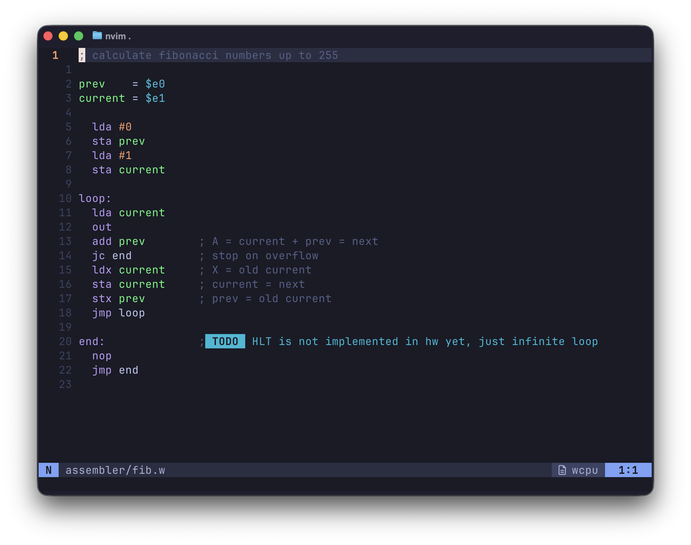

Custom syntax highlighting, comments, "variables", and being able to write code in a nice ergonomic way.

To turn this cool custom-syntax-highlighted `.w` file into the more boring format that the computer understands, we need an assembler.

Full disclaimer I did get some help from my buddy Claude Code to get through some of the boilerplate and minutiae of the coding that I generally don't enjoy. It also created all the syntax highlighting config for my neovim setup (which you can find [here](https://github.com/phybros/kickstart.nvim/commit/55f3fc7627b2ace3cf016c5a2cbb68b53df051df)!)

I wrote `wcasm` in Python and it takes in my `.w` files and outputs raw binary files, and also just prints out all the machine code (lol) which I can copy paste into the Arduino sketch in order to have it run on the computer. In future I will take these binary files and send them to an EEPROM via the EEPROM Programmer described earlier.

I used 6502-ish syntax and wanted comments and variables and that makes it way easier to write more complex programs without losing your mind.

The assembler uses the syntax to figure out which actual opcode you wanted. For example `lda #5` is a "load A register with 5" which is opcode 0x14. Similarly `lda $e1` would load A with the value stored in RAM at address `e1`.

It does two passes, the first one removes comments and whitespace, and records the locations of all the labels (like `loop:` above). The second pass converts all the opcodes and replaces variables and labels with real addresses.

### The Full Pipeline

Worth spelling out end to end because although it is janky, it is still very satisfying:

1. Write assembly in a `.w` file
2. `wcasm.py` assembles it into a raw `.bin`
3. The machine code gets embedded in the Arduino sketch
4. Upload the sketch to the Arduino with the `CLK` in "Arduino mode"
5. Arduino loads the program into RAM, releases reset
6. Switch the `CLK` back to Clock, and the CPU runs the program!

It's a lot of steps, but each one is dead simple and individually testable. In future of course, the Arduino will be gone, and wcasm will be enhanced to send the binary straight to the EEPROM via serial.

Also lots of other ways to make it nicer in future, but I might save that for `WCPU-2` 😉.

## So Is It Finished?


Nope. There are a few big things missing before I'd want to call this "finished". There are a ton of tiny little things too but I will just list the biggest missing items.

### No Output (lol!)

Yes, probably one of the most visible and important components is missing.

Yes, the computer works. No, it cannot display anything.

I had been using a second Arduino with an OLED screen (see video above) to pretend to be the output register for a while, but eventually I just watched the A register like some sort of maniac.

I sort of learned how to read binary at a glance from doing this, which is kind of hilarious. 

What a dumb thing to not build.

### The Arduino Loader Situation + RAM Split

I explained this pretty well up above, but just to recap, I want to get rid of any Arduinos in the build and rely on discrete logic and EEPROMs instead, and make the whole thing self-contained and self-managing. 128 bytes of RAM and 128 of ROM. Turn the machine on and it runs, easy!

### No HLT

Not sure why I never wired this up, but there we go. I just need to `AND` the incoming clock signal with the `~HLT` signal and that should do the trick! Right?!

### Power-On/Reset

Without the Arduino loader I'm gonna need a way to set the `IR`, Flags, `PC` and T-State to a known state before starting to execute the code from ROM. There are a few decent IC's around that can help with this that I've heard of, but I haven't done much research yet.

### Replace Sign Flag with Overflow Flag

Currently the most-significant-bit (MSB) of the last ALU result is latched in as the sign flag, which works, but I don't really care about it that much.

I kind of think that an overflow flag (`V`) would be better and more useful. Then you could see if your ALU result went out of a representable range. It takes a couple more gates to implement but it's not too bad.

### Better Clock

Not having debouncing between speed modes is a big bummer, so I'd like to fix that before I finish the final PCB design. Speaking of...

### The "Final" PCB

I'd like to get this all onto one self-contained PCB. I want it to be very "LED-forward" and be really interactive and tactile. Maybe I'll even frame it or put it on my nightstand, who knows?

## What's Next?

You can expect a Part 4 where hopefully I will have addressed all the missing features and components, and built the first and hopefully final version of the definitive WCPU-1 PCB.

After that...WCPU-2 of course! I have a really long wishlist of things for WCPU-2 including but not limited to:

- Separate buses: 16 bit address bus, 8 bit data bus
- 16 bit stack pointer and program counter
- More capable ALU: AND/OR/NAND/NOR/NOT/XOR/SHL/SHR etc
- much much more......

I want to graduate into "real computer" territory and that makes me insanely excited.

### Open Sourcing

I will be sharing everything on my [ Github](https://github.com/phybros), but not yet.

The project is currently an incomprehensible mess of files in about 12 different folders strewn across 2 different computers 😭

But yes I do plan to open source the entire thing, including the toolchain, full PCB design files, and BOM so you can get your own made and program it easily, should you want to.

## Conclusion

This project has been a really long time in the works, and required a huge amount of mental energy. Sometimes I just sat there thinking about clock phases for ages, or wondered about EEPROM glitches in the shower like a totally normal person.

A project like this is potentially a huge rabbit hole. The hardest part is knowing when to stop adding features. I came super close to adding a stack and stack pointer to WCPU-1, but in the end I feel like then I'd want to have more RAM, maybe banking, and then GPIO etc etc etc it just never ends. So knowing where to cut it off is a good idea. Keep that scope creep to a minimum!

I learned an astronomical amount via this project and it's been super rewarding so far, and I think it will continue to be ☺️.

For the next project, before buying a bunch of things or building another huge jungle of wires in service of WCPU-2, I'm going to have a look at FPGA development, and try to build the WCPU-1 on there. From there hopefully I can use it to rapidly prototype WCPU-2 and get the design totally finalized before getting into real components.

## Now Let's Talk About PCBWay!


**Disclosure**: [PCBWay](https://pcbway.com) reached out to sponsor this project. They provided the PCB fabrication and shipping for the boards described in this section for free. However, they wanted me to be as honest as possible.

All opinions, mistakes, and backwards LEDs are my own.


### The Good

The PCBs themselves are of a great quality. Really nice finish, clear silkscreen, quick turnaround. All the things I expected. The major errors on the EEPROM board were totally my fault. The fabricated boards were exactly what I designed.

The interactions with customer service were fast and clear, and they made things happen quickly.

### The Less Good

The Register and EEPROM Programmer boards arrived in a box with someone else's PCBs instead of my Control Module boards which set me back a few days.

[PCBWay](https://pcbway.com) offered to remake and re-send the boards at no charge, which was awesome! They were incredibly
proactive about this as soon as I reported the issue, and began the manufacturing of a new batch immediately. The new boards
were in my hands 3 days after emailing them about the problem.

I had to pay import duties a second time, which was a bummer, but I let customer service know and they credited that amount back to my [PCBWay](https://pcbway.com) account immediately, which was amazing.

### Conclusion

PCBWay's PCB fabrication service is generally awesome. I would recommend to anyone who is doing low volume hobby stuff with just a few caveats listed above. The shipping error that bit me is not common, I just got unlucky.

## Thanks for Reading!

I can't believe you read this all the way to the end!

See you in part 4 😎

💾

---

You can see all posts from this series at [/tags/wcpu-1](/tags/wcpu-1).

Come roast me on [Mastodon](https://hachyderm.io/@willwarren) or [Bluesky](https://bsky.app/profile/willdavidwarren.bsky.social)!
