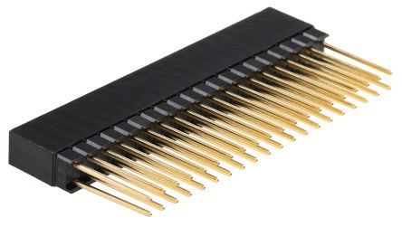

I'm designing and building my own 8-bit CPU! It is called the `WCPU-1`.

I've been inspired by creators like [James Sharman](https://www.youtube.com/@weirdboyjim/videos) and, of course, [Ben Eater](https://www.youtube.com/@BenEater), whose tutorials and projects have been super helpful. Their work sparked my interest in creating custom CPUs and exploring the crazy world of retro-computing. A project like this touches on all the different things I've learned over the years, combining electronics, hardware design, programming, and computer science.

I'm also drawn to the fact that I, as the designer, can make it into whatever I want.

So many awesome computer systems of yesteryear were 8-bit - the NES, the Apple
I and II, Atari, BBC Micro, PET, VIC-20 etc etc etc. I hope to create one that
is actually useful, and not just good for calculating fibonacci numbers or counting to
255 (no shade!).


**Note**: This isn't a tutorial series - if you want to learn more about all this I suggest starting with [this playlist from Ben Eater](https://www.youtube.com/playlist?list=PLowKtXNTBypGqImE405J2565dvjafglHU) and then going from there!

These posts are mostly just my thought processes and random notes.


## Constraints

Wishlist:

### I'd like to be able to write programs longer than 16 bytes 💪

This seems self explanatory! More code and data!

### I'd like to create some sort of peripheral expansion 🌱

Think GPIOs, serial port, LCD screens etc. No idea how to accomplish this.
Something something memory mapped I/O...I'm sure it'll be fine!

### CMOS over TTL 👴

There's not really a good reason to use TTL chips like the 74LS series any more. Even if I were using the LS's, I would still be using pullup/pulldown resistors
on all the floating pins - so why not just go full CMOS and save money and
power?

### No breadboards 🙅‍♂️

I've designed a ton of PCBs at this point, and frankly the thought of bending
all those wires into place just makes me not want to do the project.

This does mean that there will need to be a lot more design before any sort of
real world blinky lights (to avoid costly mistakes).

No breadboards makes it harder to tinker, but I do want the `WCPU-1` to be
tinker-able. Which brings me to...

### Modular, in any order 🧩

I'd really love to have a sort of lego vibe where the modules can all be
arranged in almost any configuration or order. Also some breakout ability to interface
with breadboards (I know, I know).

This approach also means I can work on one piece of the hardware at a time.

I have this vision of a vertical stack of PCB's, spaced out 10-15mm with a million blinky LEDs. 

### Blinkenlights 🚦

Kind of goes without saying, but this thing obviously needs as many blinky LED's as I can fit on it.

## Logical Design Spec

Based on the above constraints, there will need to be some differences between
something like the SAP-1 architecture (similar to Ben Eater's computer) and
`WCPU-1`.

- 8-bit instruction register instead of 4-bit
	- Ben uses 4 of the IR bits for the instruction and 4 for the operand, so
	  if I want 8-bit memory addresses, I'll need somewhere to put those
	- An extra register to store the optional "operand" byte for
      instructions makes sense
    - This leaves 8 whole bits for the instruction register - although I don't
      think I'll be able to use all of them due to needing to fit the
	  instructions plus the T-step plus the flags into 12 bits (will probably
	  cover this in a later post)
- 256 bytes of RAM instead of 16 bytes
	- This is the largest amount addressable with a simple 8-bit address
	- I could expand it up to 64KB with another register (for banking/paging)
- 8-bit program counter
	- Lets me iterate through 256 bytes of program code and data instead of 16

I'm quite interested in using the **Harvard architecture** (data and code
separated, separate address and data buses), but for the sake of simplicity I'm
going to stick to the **Von-Neumann model** (RAM shared between data and code,
can use a single data/addr bus).

Maybe `WCPU-2` can use the Harvard model 😜

## Bus

The bus will be 8 bits wide, and used to transfer data and/or addresses etc. between modules.

`WCPU-1` is supposed to be modular, which means most things should interact with the bus. This means I can "just" run the bus to every module and that will meet most of my needs.

## Control Logic

Forget what I just said - there are a zillion other control lines that form the "Control Word" which need to run to almost every module. Things like "hey A register, latch whatever's on the bus into yourself". Pretty important to ensure that the control unit has a connection to the A register in that case.

## "SUPERBUS"

Let's say I want to stack all my modules together vertically in any order. That means every module needs to pass through power/gnd as well as the bus and the entire control word. That sounds like a lot of connections.

I am considering something like this connector from Harwin (`M20-6102045`). It
is designed for the `PC/104` standard which is for .... wait for it ....
stacking modular PCB's together.

They are kind of pricey, but gives me 40 connections that can flow to all the
modules.

The Instruction Register doesn't need to look at the "RAM_LOAD" control signal,
but it does need to pass it through if I want to maintain the "any order" 
constraint...

I have a sneaking suspicion I'm going to regret this decision later.

The next post will cover the various modules I want `WCPU-1` to have.

💾

---

You can see all posts from this series at [/tags/wcpu-1](/tags/wcpu-1).

Come roast me on [Mastodon](https://hachyderm.io/@willwarren) or [Bluesky](https://bsky.app/profile/willdavidwarren.bsky.social)!
