This is part 2 of a series about designing and building my own 8-bit CPU! Part
1 can be found here:
[Building My Own CPU - Part 1](/2025/04/29/building-my-own-cpu-wcpu-part-1)

Before getting into schematics and PCB design and things like that, I need to make quite a lot of decisions. If I could just think really hard and a perfectly formed PCB would pop out, that would be great. But that’s just not how my brain works. I need to see it to build it.

I’m addition to *that*, I’m trying to avoid too much breadboarding which leaves but one option: simulation.

I fired up good old [Logisim-Evolution](https://github.com/logisim-evolution/logisim-evolution) and got to work.

## Simulation v.s. IRL

There are some gotchas with simulating a CPU, mostly around how virtual circuits behave vs their real life counterparts. For example, on a rising clock edge you may be able to output from RAM and latch the value into a register at the same time. In real life the RAM will take more time to settle after the address lines are asserted (e.g. 100-200ns) than the register does to latch (e.g. 10-20ns).

This basically means that pour clock will need to be “biphasic”. That is, slow stuff should happen on the rising edge, take its time to settle, then fast things should happen on the falling edge.

This limits the “width” of our clock pulse to the slowest component in the circuit. If we go any faster we will see weirdness. If we said that 200ns is the slowest component then technically that means we can run our clock at maximum of 5MHz. However that doesn’t take into account additive propagation delays (e.g. 2 registers added together will have twice the overall propagation delay).

This lets us set a nice goal of a max clock speed of about 4MHz which is plenty fast.

These delays aren’t as much of a factor in the simulator, it’s just something we need to be aware of when starting out.

## Clock

This is quite easy in Logisim since it has a Clock element you can use, enable and disable with ⌘K, as well as single step using ⌘T. The only 2 things I added here are an inverted version of the clock signal (`CLKn`) and `AND`ing it with a signal called `HLT` which will allow the computer to stop itself by setting `HLT` high.

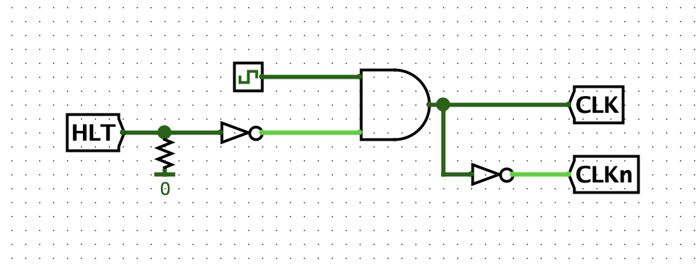

## Registers

To speed up the process, I made a reusable register block and will use it for all of the registers in the build such as `A`, `B`, instruction register, etc.

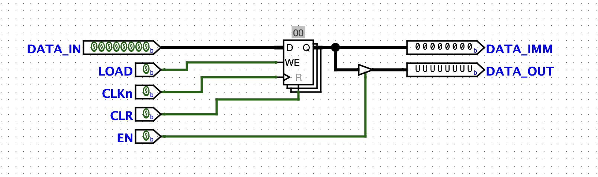

The block can take in 8 bits, and has an immediate output, as well as an output controlled by the `EN` signal (using a "controlled buffer"). The `EN` signal will be used mostly when we want to output that register onto the bus. The control logic will be handling turning that on and off. We can write to the register by setting `LOAD` high, and reset it to 0 by setting `CLR` high.

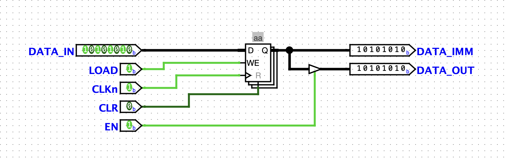

The registers will be triggered by the falling edge of the clock pulse. You can set registers in Logisim to be “falling edge” triggered but I’m going to just have an inverted clock signal blocks can use instead of doing that.

Now we have a reusable block, I can just slap them down wherever.

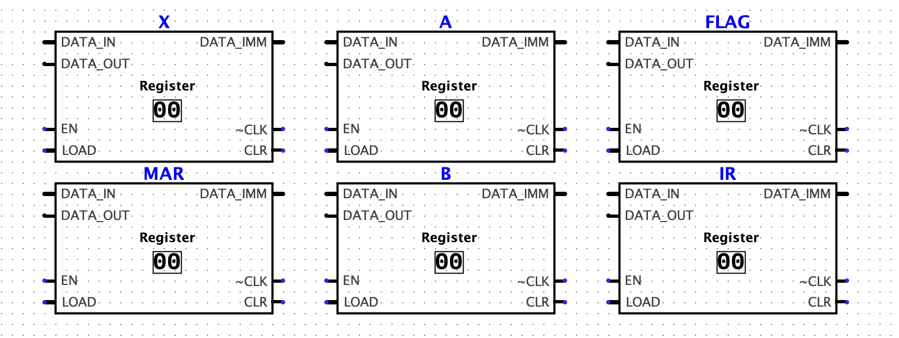

## ALU

We can again take a number of shortcuts to build the adder block. Logisim has an adder component, as well as a comparator (so we can check for zero).

The most basic layout could look like this:

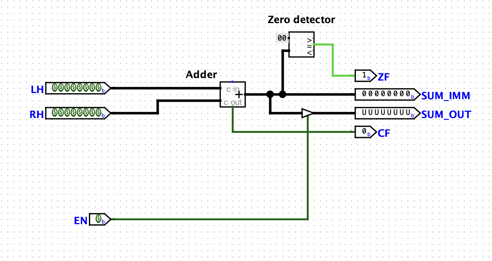

This has the ability to control its output the same way as the registers do, as well as outputting the carry and zero flags that we can use later.

### Adding Subtraction (pun intended)

`XOR`ing the right-hand operand with the `SUB` flag and adding 1 by also passing the `SUB` flag in as the carry bit allows us to subtract numbers.

In this screenshot you can see the new layout, as well as a basic subtraction (3 - 1) and its result (2) on the `SUM_IMM` pin.

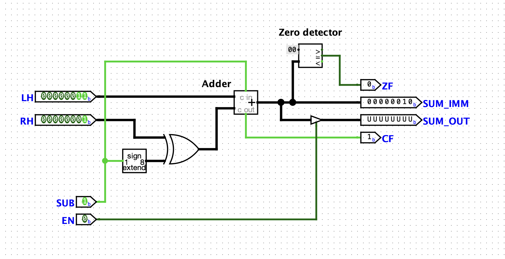

If the result is a negative number, it is output in [two's complement](https://en.wikipedia.org/wiki/Two%27s_complement) format like this (-2):

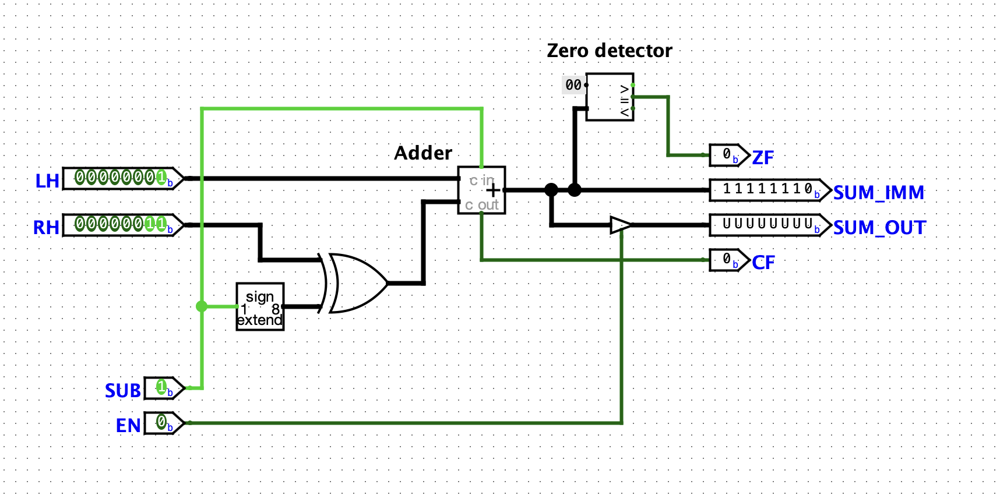

It would be cool to be able to tell if we should interpret the answer as a negative or positive number. If we looked a `11111110` as a regular unsigned integer, it would be `254` in decimal. But in two's complement it should be read as `-2`.

If we wanted to add a new "sign flag" we can cheat in Logisim using the ">" output of our zero detector (meaning that 0 is greater than the input):

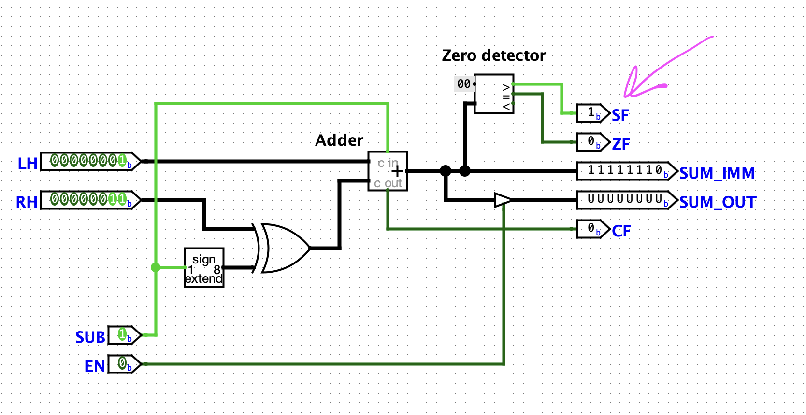

We will need to put some thought into how to build the zero detector and sign flag in real hardware later. This is the danger of logisim. It allows you to validate the basic ideas, bit widths, instruction formats etc. But when it's time to build the real hardware it can be a bit of a challenge to match the behaviour.

## RAM

We can just use Logisim's RAM module here, no need for a separate block. I set "Data bus implementation" to "One bidirectional data bus" and "Enables" to "Use line enables" (and show label).

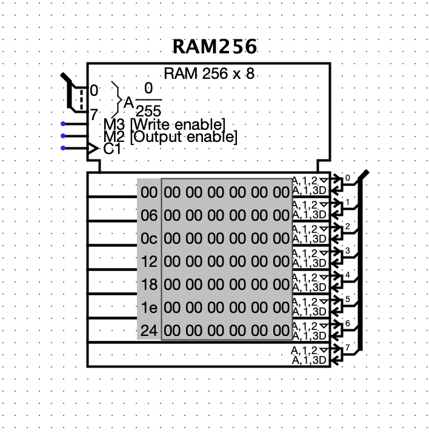

## Counters

We need a counter for the Program Counter and also the Microcode Step Counter. I'll just use the Counter modules that come with Logisim. In real life I'll probably use something like `74HC590` or something similar. I set the Step Counter to 4 bits since I only want a max of 16 microcode steps per instruction. The Program Counter is just default (8 bits).

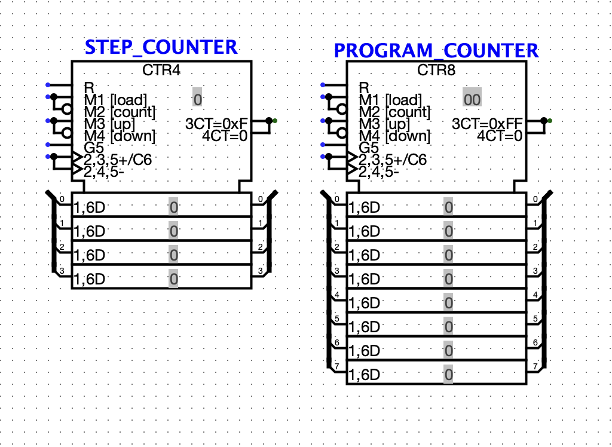

These are Rising Edge triggered again, but I will hook their clocks up to the aforementioned `CLKn` signal to separate their latching from the RAM/ROM outputs.

## ROM

In place of EEPROMs in Logisim we can just use the ROM module. I set them to 12 bit addresses, and in my case I need 3.

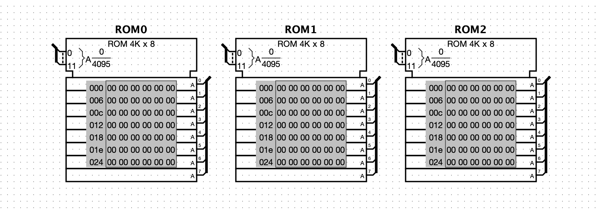

The reason for 12-bit addresses is that the microcode address will be laid out like this:

```
| FLAGS |INSTRUCTION|   STEP  |
| - - - | - - - - - | - - - - |
| 3 bit |   5 bit   |  4 bit  |
```

- 3 bits for flags: `CF`, `ZF`, `SF`
- 5 bits for instruction opcodes (max 32 different instructions)
- 4 bits for the T-Step (16 possible microcode steps)

And then I have the ability for up to 24 different Control Lines to be asserted as a result.

## Connecting all together

Not sure of the best way to convey this via a blog post, so I will just upload
a really big screenshot

[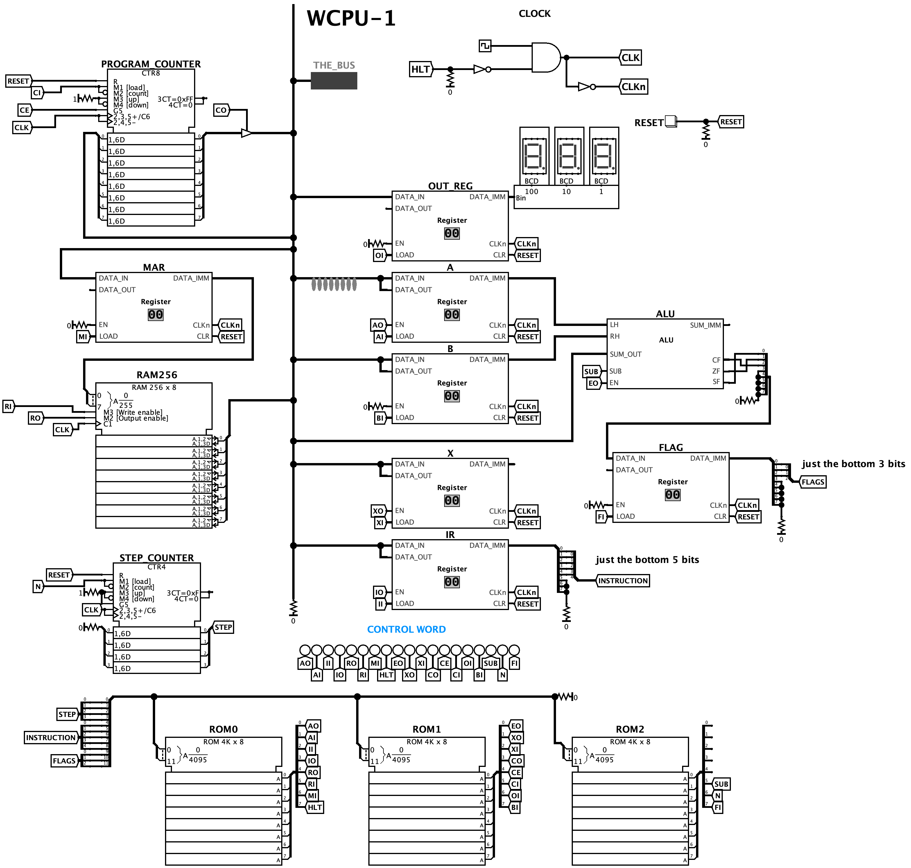](big-screenshot.png)

There's quite a few things in here that I haven't gotten into, such has the
microcode, instruction set, and my custom "assembler" and "development
environment" which I will save for the next part. I also created an emulator!
