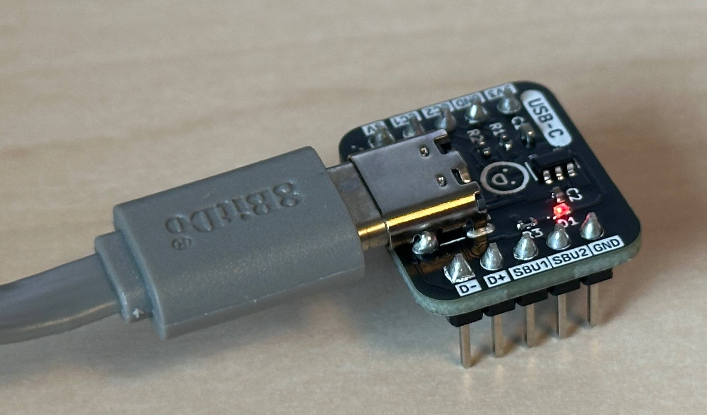
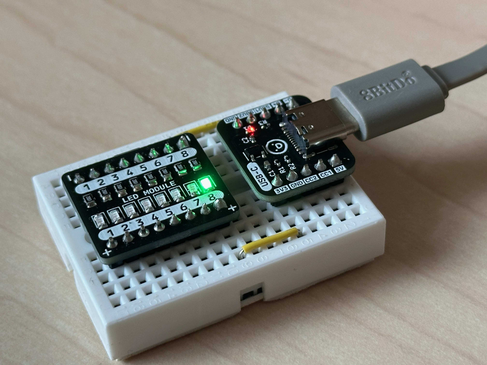
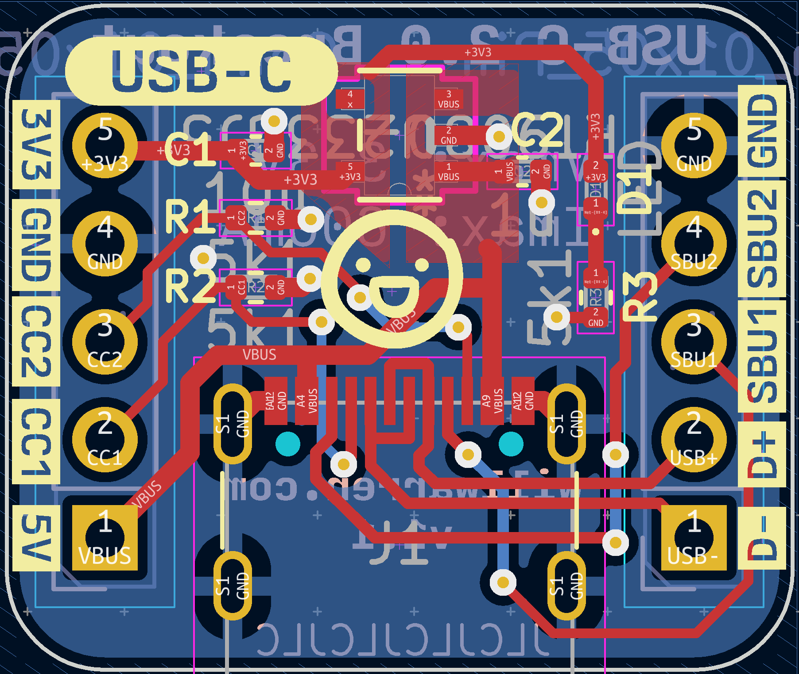

## What is it?

This handy little device not only powers your breadboard projects but also
breaks out the data lines (D+/D-), so you can easily connect and communicate
with microcontrollers or similar gadgets straight from your computer.


Support me by buying one from my [Tindie Store](https://www.tindie.com/products/phybros/usb-c-breadboard-power-supply/)! 🙃


## Tech Specs

The board is based around the
[Richtek RT9080-33GJ5](https://octopart.com/rt9080-33gj5-richtek-75277504) which
is a Low Dropout (LDO) DC-DC Voltage Regulator. It can provide up to 600mA of
current at 3.3V. Perfect for powering microcontrollers and over 3.3V logic IC's.

Additionally the board sports a tiny 0402 red LED indicator to show that the
LDO is powered up and functioning.

### Pinout

| Pin | Description |
|----|----|
| **5V** | Connected directly to VBUS from your USB port. Can provide up to 3A (if your source can provide it) |
| **3V3** | 3.3V at up to 600mA |
| **GND** | Ground connection |
| **D+/-** | USB data line differential pair |
| **CC1/2** | "Configuration Channel" pins. These are connected to GND via 5.1kOhm resistors, to signal the source to please provide 5V @ (up to) 3A |
| **SBU1/2** | "Sideband Use" pins. Typically for audio or video applications |

### Design

The main design goal was to make it as narrow and short as possible, so you can
fit lots of jumper wires on either side, and to have all of the USB 2.0 pins
broken out.

The schematic and PCB were designed in KiCAD 7 and manufactured by JLCPCB. I
manually assembled the boards after they arrived using a hotplate and solder
paste and a lot of patience with these teeeeeny tiny 0402 components.

That's it! I've used these boards many times now during the prototyping phase
for my various projects involving low power sensors, IoT and home automation.


Grab one for yourself from my [Tindie Store](https://www.tindie.com/products/phybros/usb-c-breadboard-power-supply/)! 🙃

