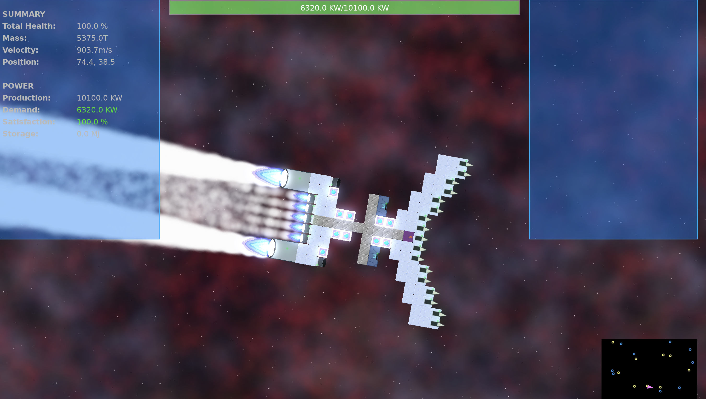
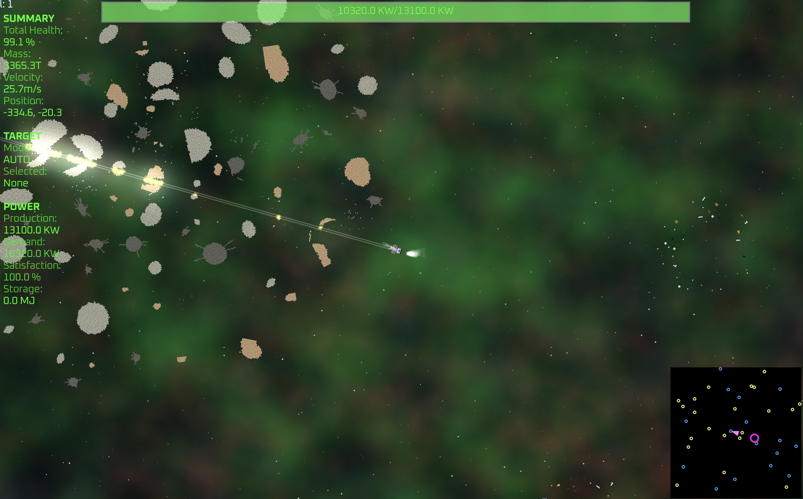

For the last year or so I've been working on a video game project. It's a
team effort with me doing the coding and my son being the creative force
and art director (and occasional coding).


Note! All the graphics and artwork are placeholders. We're going to do a big art pass later in development.


")

We've worked on the game together for a really long time, and spent a lot of time
thinking about systems and gameplay elements. I figured I should probably
post about some of the things we've done along the way.

## About Snapship

At its foundation Snapship is a 2D sci-fi roguelike where you take control of a
sentient AI core. You slowly assemble a spaceship around yourself from blocks that you
find or fabricate in order to become more powerful.

Some big inspirations for the game come from FTL, Factorio and Subnautica.

Ships are physically simulated meaning that your mass distribution and thruster
placements actually matter. If one of your thrusters gets destroyed you might be flying
crooked until you can rebuild it, or you can just redesign your ship on the fly.

Similarly, use too many heavy blocks, and you might find yourself flying at a
snail's pace, unable to accelerate very much.

The game's working title is Snapship (because you "snap" ships together from
blocks...taking suggestions on a better name).

As a player, you have to manage your power usage, resource gathering, thermals,
inventory distribution and crafting networks, as well as fly and shoot of course.

Your ship can be rebuilt or reconfigured at any time. Boost your power generation and spec into railguns, build a dense crafting
network and become a missile platform, route all your thermal energy into internal heatsinks and avoid detection...

## Objective

Through exploration, combat, mining, stealth, creativity and skill you will descend
through the seven planes of dissonance and reach the darkness at the center.

Or you won't...

Dying and starting over is part of the **fun**.

!")

## Release Date

The game is still very much in development, so don't expect a release any time soon, but we hope sometime in 2027.

Follow along here for more updates. We will be looking for alpha playtesters in the not too distant future!

Leave a comment below!